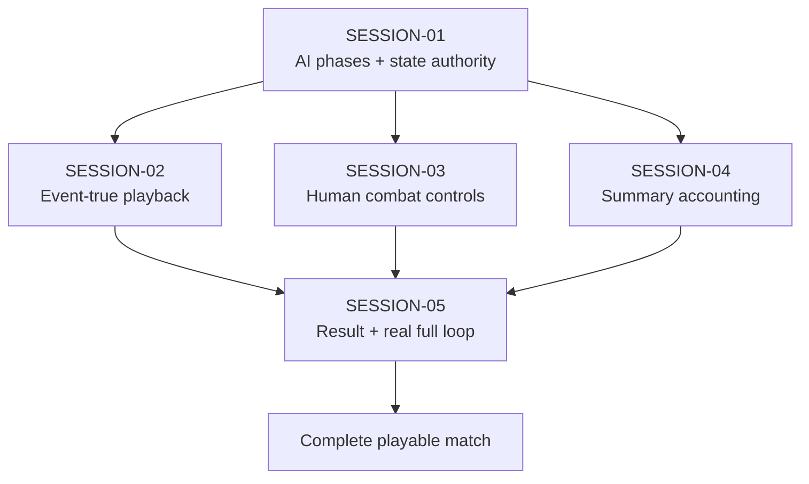

# State Tracker — SIGNAL LOSS / complete-match-loop

## Program / Feature / Intent / Sessions

- **Program:** SIGNAL LOSS (`signal-loss`)
- **Feature:** `complete-match-loop`
- **Intent:** Turn the shipped post-deployment slice into a complete playable browser match: all four AI squads move and attack through workers, human combat and pool edits are truthful, playback cannot strand or reveal the final state early, rounds roll through trace/elimination, and completion reaches a full result/rematch flow.
- **Sessions:** Five ownership-coherent sessions. SESSION-01 establishes phase AI and store authority. SESSION-02 and SESSION-03 independently close playback and human combat. SESSION-04 corrects/derives summary accounting in parallel. SESSION-05 integrates the result flow and proves the real browser loop.
- **Program config:** `./program/signal-loss/FORGE-CONFIG.md`
- **Prompt directory:** `./program/signal-loss/prompts/complete-match-loop/`

## Session Status

| # | Session | Modules | Owns | Status | Checkpoint | Completed | Notes |
|---|---|---|---|---|---|---|---|
| 01 | Wire AI Decisions and Phase-Safe Match State | M02, M17, M20, M22 | `./data/ai.weights.json`; phase AI/store files; `./src/app/screens/match/MatchScreen.tsx`; focused app tests | done | 3/3 | 2026-08-29 | Wired four real worker decisions for movement and attack, enforced exact phase readiness, and deferred authoritative engine updates until playback completion. |
| 02 | Deliver Event-True Playback and Controls | M09, M18, M19, M20, M22 | movement event files; playback board/components/screen; focused engine/app/browser tests | done | 4/4 | 2026-08-29 | Delivered event-true playback projection, truthful command-bar transport, progressive logging, reduced-motion parity, exact AI readiness gates, and reusable real-match browser coverage. |
| 03 | Make Human Combat Honest and Operable | M19, M20, M22 | attack screen/model/components/styles; focused app tests | done | 2/2 | 2026-08-29 | Delivered public-safe engine-backed attack previews, exact hit routing, guarded pool edits, keyboard controls, playback spend reporting, and production attack styling. |
| 04 | Make Match Summary Accounting Authoritative | M09, M17, M22 | `./src/engine/match/end-round.ts`; `./src/app/store/core/result-summary.ts`; focused tests | done | 2/2 | 2026-08-29 | Corrected exactly-once pool waste accounting and added the authoritative, event-derived match result summary contract. |
| 05 | Close the Real Match Loop and Result Flow | M17, M19, M20, M22 | flow result contract; result mode/route/components; combat/full-loop browser tests | in-progress | 0/4 | — | Launched by Jikijitsu with the Zen split-phase binding on OpenAI Codex. |

## Wave Plan

| Wave | Sessions | Why concurrent |
|---|---|---|
| 1 | SESSION-01 | Foundational state contract: later UI must target exact `READY_MOVE` / `READY_ATTACK`, deferred engine authority, zero-event completion, history, and opponent-model semantics. |
| 2 | SESSION-02, SESSION-03, SESSION-04 | Their write sets are literally disjoint after SESSION-01. Playback owns movement events/board/transport; combat owns attack UI only; summary owns end-round accounting and a pure result model. Only SESSION-02 reserves the browser port. |
| 3 | SESSION-05 | Integrates the landed playback, combat, and summary contracts, then owns the serialized browser acceptance and result/rematch route. |

## Dependency Graph

## Architecture Reference

- **Existing rule engine stays authoritative:** movement, simultaneous attack, damage, trace, destruction, elimination, and deterministic ordering already have substantial M09/harness coverage. This feature changes M09 only where concrete presentation/accounting evidence requires it: `MovedEvent` lacks its plotted path, and end-round currently double-counts pool waste.
- **AI fairness boundary:** movement/attack orchestration sends only per-squad `PublicState` through the existing worker protocol. No draft, `MatchState`, direct M11 call, wall-clock budget, or silent empty plot is allowed.
- **Commit/readiness boundary:** command controls expose exact pending/error status, but M17 store guards are final. A commit cannot resolve without four matching phase-ready AI slots.
- **Playback authority:** the engine computes the result once. The pre-snapshot remains authoritative during playback; an event prefix alone drives presentation deltas; `playbackFinish()` applies the stored after-snapshot.
- **Resolution-loss boundary:** event data is complete internally, but canvas/preview adapters render enemy positions through the human public projection. A ghost never gains exact hidden position, path, range, or LOS from an authoritative snapshot.
- **Summary boundary:** M09 cumulative totals and the complete public event history feed one pure result-summary derivation. UI and flow transport that value; they do not reproduce placement, pool, or hash rules.
- **Transient flow:** launch/result/rematch payloads remain app-lifetime Zustand values. Collection data, `localStorage`, and `./src/migrations/**` remain untouched.

## Scope Summary

| Module | Affected paths | Change |
|---|---|---|
| M02 | `./data/ai.weights.json` | Add a validated bounded plot-search budget for production movement/attack AI requests. |
| M09 | `./src/engine/match/events.ts`, `./src/engine/match/movement.ts`, `./src/engine/match/end-round.ts` | Carry the exact plotted path for playback and count completed-round pool waste exactly once; no rule-math redesign. |
| M17 | precise files under `./src/app/store/match/` and `./src/app/store/core/` | Start phase AI, split readiness kinds, guard resolution, defer engine replacement, retain history/opponent model, derive/transport complete results. |
| M18 | precise files under `./src/app/board/` | Project and paint presentation-only event frames with public-position filtering and semantic parity. |
| M19 | precise files under `./src/app/components/match/` and `./src/app/components/result/` | Add truthful transport/log, engine-backed combat preview/pool controls, and the result surface. |
| M20 | precise files under `./src/app/screens/match/` and new `./src/app/screens/result/` | Mount real AI phases, operate attack/playback, hand off completion, and self-register `#/result`. |
| M22 | precise files under `./tests/engine/`, `./tests/app/`, and `./tests/e2e/match/` | Cover phase/state invariants, event frames, combat guards, accounting, a real combat round, and a bounded full browser match. |

## Design Decisions

1. **Forge a feature; do not extend the movement one-off:** the prior `fix-movement-commit` work proved one movement commit. The remaining failures cross AI lifecycle, store authority, playback, attack UI, statistics, routing, and result actions. Reusing that narrow lease would hide dependencies and cause shared-file collisions.
2. **Prove the browser orchestration, not the pure engine again:** `./tests/harness/support/runner.ts` already executes full AI rounds headlessly. New work focuses on the missing browser adapters while retaining engine integration tests for the two proven engine defects.
3. **Never fabricate AI intent:** an absent/wrong worker response blocks commit. Empty movement/attack plots are accepted only when a real AI decision explicitly returns them.
4. **Precompute result, defer authority:** deterministic resolution completes before animation, but the board/store remain at the before-snapshot until the user finishes/skips playback. This satisfies FR-26 without letting animation influence rules.
5. **Extend `MovedEvent` rather than guess a path:** lengths/endpoints cannot truthfully animate a multi-segment route or unwalked halt stub. The engine already owns the normalized path and emits it as presentation-only event data.
6. **Filter complete events through public confidence:** internal events do not grant the human exact distant positions. Playback and exchange preview use last-confirmed public positions and label uncertainty.
7. **Use engine preview twice, never parallel math:** normal and called matrix rows each come from `exchangePreview()`. The UI contains no damage rounding or minimum-one formula.
8. **Guard pool at edit and commit:** pointer/keyboard edits refuse the first overspend and show remaining balance; M09 `legalAttackPlot()` remains final authority.
9. **Fix pool totals at their duplicate site:** attack resolution counts the just-completed round, including terminal rounds. Refill grants the next pool but does not count old waste again.
10. **Do not invent standings after human elimination:** the result reports the human's actual placement and recorded eliminations; AI squads still alive under the immediate-stop rule are explicitly `SURVIVED_AT_END` without fake rank/round.
11. **Real acceptance, no test door:** browser tests use release content, setup/map generation, real workers, dialogs, canvas clicks, playback controls, trace, and the result route. They never mutate Zustand from the page or inject events.
12. **No migration/package scope:** no persistent result, new dependency, runtime network, spec/mock edit, or schema lease is needed.

## Feature Acceptance Contract

1. Real setup/deployment reaches movement with four AI squads.
2. A positive human move plus four real AI moves resolves and visibly plays from pre-state to post-state.
3. Pause, resume, step, speed, skip, reduced motion, zero-event playback, log history, and continue all work without mutating the result.
4. Attack waits for four real AI attacks; exact target/pool edits work with pointer and keyboard; the preview matches engine math without fog leakage.
5. Attack, damage/defense, posture, dial, trace, destruction, elimination, and round rollover appear as ordered playback/log facts.
6. Pool totals remain exact across multiple rounds.
7. A bounded real match completes and reaches `#/result` with a complete authoritative summary.
8. Same-seed rematch, new-seed rematch, copy/manual-copy, and build-zone return are functional and non-persistent.
9. Unit/type/lint/build gates pass; combat round passes in Chromium/Firefox/WebKit; full match passes in Chromium.

## Handoff Notes

### SESSION-01

- **notes:** Wired four real worker decisions for movement and attack, enforced exact phase readiness, and deferred authoritative engine updates until playback completion.
- **followUp:** Consumers must require READY_MOVE or READY_ATTACK exactly. Resolution leaves engine and engineRevision unchanged until playbackFinish(), which also appends history and folds attack posture reveals into opponentModel.

### SESSION-02

- **notes:** Delivered event-true playback projection, truthful command-bar transport, progressive logging, reduced-motion parity, exact AI readiness gates, and reusable real-match browser coverage.
- **followUp:** The reusable Tier 1 real-match helper in ./tests/e2e/match/support/real-match.ts provides deterministic setup, deployment, world-coordinate canvas clicks, positive movement plotting, and runtime-failure collection for SESSION-04/SESSION-05.

### SESSION-03

- **notes:** Delivered public-safe engine-backed attack previews, exact hit routing, guarded pool edits, keyboard controls, playback spend reporting, and production attack styling.
- **followUp:** SESSION-05 can consume the attack-model boundary and should exercise the complete combat flow in its owned browser tests.

### SESSION-04

- **notes:** Corrected exactly-once pool waste accounting and added the authoritative, event-derived match result summary contract.
- **followUp:** SESSION-05 should consume deriveMatchResultSummary directly and render SURVIVED_AT_END entries without assigning placement or elimination round.

### SESSION-05

—
