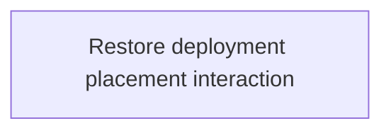

# State Tracker — SIGNAL LOSS / fix-deployment-placement

## Program / Feature / Intent / Sessions

| Field | Value |
|---|---|
| Program | **SIGNAL LOSS** (`signal-loss`) |
| Feature | `fix-deployment-placement` |
| Intent | Make initial deployment discoverable and responsive: clearly mark the human spawn, support selected-unit plus board-click placement, show staged feedback, and prevent match start until every human construct is placed. |
| Sessions | 1 total |
| Program config | `./program/signal-loss/FORGE-CONFIG.md` |
| Prompt directory | `./program/signal-loss/prompts/fix-deployment-placement/` |

## Session Status

| # | Session | Modules | Owns | Status | Checkpoint | Completed | Notes |
|---|---|---|---|---|---|---|---|
| 01 | Restore Deployment Placement Interaction | M18, M19, M20, M22 | `./src/app/board/BoardCanvas.tsx`; `./src/app/board/layers/overlay-layer.ts`; `./src/app/board/layers/terrain-layer.ts`; `./src/app/components/match/CommandBar.tsx`; `./src/app/components/match/match-shell.css`; `./src/app/screens/match/DeploymentMode.tsx`; `./tests/app/match/deployment-mode.test.tsx`; `./tests/e2e/match/deployment-placement.spec.ts` | in-progress | 0/3 | — | The current valid click path works only inside squad `0`'s derived spawn, which the UI does not identify; draft positions are not rendered and the commit button is not gated. |

## Wave Plan

| Wave | Sessions | Why concurrent |
|---|---|---|
| 1 | SESSION-01 | One session owns the shared board painter, deployment screen, command bar styling/gate, and their tests. The files form one interaction contract; splitting them would create an avoidable handoff between the pointer producer and its visual/commit consumers. |

## Dependency Graph

## Architecture Reference

- `./src/engine/match/deployment.ts` remains the sole authority for full
  deployment legality and the simultaneous reveal. No engine or map-generation
  file is in this feature's lease.
- `./src/app/screens/match/DeploymentMode.tsx` owns the human-only draft UX.
  `deploymentDrafts` remains a `HumanDraftState` value in M17 and is never
  copied into `MatchState`, `PublicState`, or AI worker requests.
- `./src/app/board/BoardCanvas.tsx` continues to own one shared camera and three
  stacked canvases. Terrain owns spawn affordances; overlay owns transient
  deployment previews; the HTML accessible tree remains the semantic mirror.
- The human spawn is identified by `launch.humanSquadId` and
  `engine.map.spawns[humanSquadId]`; the standard generator's current placement
  at the upper-left is an observed geometry result, not a rule to hard-code.
- `./src/app/components/match/CommandBar.tsx` must gate both pointer and
  `Ctrl+Enter` / `Cmd+Enter` deployment commits from the same complete-draft
  predicate. The engine still validates complete placement legality.

## Scope Summary

| Module | Change |
|---|---|
| M18 — Board renderer | Highlight the observer's deployment region and render snapped staged/hover placement feedback without changing shared pointer conversion. |
| M19 — UI components | Make deployment status readable in match chrome and disable the irreversible commit until the roster is complete. |
| M20 — Screens | Wire selected-construct and next-unplaced placement, reposition/unplace editing, live reasons, and board preview state. |
| M22 — Verification tests | Add static deployment contract coverage and a real multi-browser setup-to-match placement regression. |

## Design Decisions

| Choice | Rationale |
|---|---|
| Treat the report as an affordance/input repair, not an engine repair | A deterministic probe showed that a valid click inside `map.spawns[0]` already stages a draft; center clicks are rejected because the center ring is not the spawn region. |
| Derive the active region from `humanSquadId` | Squad-to-region assignment is part of the generated map contract. Hard-coding the upper-left screen location would break alternate maps/cameras. |
| Support selected row plus click, with next-unplaced fallback | This satisfies the design's `select + click` path while preserving a fast first-click experience for players who simply click the board. |
| Render drafts on the overlay/field presentation only | Placement remains editable UI state until `BEGIN MATCH`; no intent or uncommitted position can leak into engine/public/AI state. |
| Disable `BEGIN MATCH` for incomplete drafts | The design requires the irreversible action to communicate `N CONSTRUCTS UNPLACED`; an enabled button that only produces a partial-deployment engine error reads as no-op behavior. |
| Keep complete-but-illegal validation in the engine | Wall/footprint/cross-placement legality and simultaneous reveal already have a single authoritative implementation in M09; the UI must not duplicate rule logic. |

## Handoff Notes (Jikijitsu writes here after each session — from Mu's handoff JSON, verbatim)
