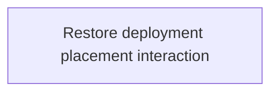

# State Tracker — SIGNAL LOSS / fix-deployment-placement

## Program / Feature / Intent / Sessions

| Field | Value |
|---|---|
| Program | **SIGNAL LOSS** (`signal-loss`) |
| Feature | `fix-deployment-placement` |
| Intent | Make initial deployment discoverable and responsive: clearly mark the human spawn, support selected-unit plus board-click placement, show staged feedback, and prevent match start until every human construct is placed. |
| Sessions | 1 total |
| Program config | `./program/signal-loss/FORGE-CONFIG.md` |
| Prompt directory | `./program/signal-loss/prompts/fix-deployment-placement/` |

## Session Status

| # | Session | Modules | Owns | Status | Checkpoint | Completed | Notes |
|---|---|---|---|---|---|---|---|
| 01 | Restore Deployment Placement Interaction | M18, M19, M20, M22 | `./src/app/board/BoardCanvas.tsx`; `./src/app/board/layers/overlay-layer.ts`; `./src/app/board/layers/terrain-layer.ts`; `./src/app/components/match/CommandBar.tsx`; `./src/app/components/match/match-shell.css`; `./src/app/screens/match/DeploymentMode.tsx`; `./tests/app/match/deployment-mode.test.tsx`; `./tests/e2e/match/deployment-placement.spec.ts` | done | 3/3 | 2026-08-28 | Human deployment repaired: YOUR SPAWN affordance + dim, staged/hover markers, select+click and next-unplaced placement, visible reasons/unplace, and BEGIN MATCH gated on a complete human roster (button + Ctrl/Cmd+Enter). Full MOVEMENT_PLOT transition blocked by missing in-match AI deployment orchestration (out of lease) — engine correctly rejects unplaced AI squads with no partial commit. |

## Wave Plan

| Wave | Sessions | Why concurrent |
|---|---|---|
| 1 | SESSION-01 | One session owns the shared board painter, deployment screen, command bar styling/gate, and their tests. The files form one interaction contract; splitting them would create an avoidable handoff between the pointer producer and its visual/commit consumers. |

## Dependency Graph



## Architecture Reference

- `./src/engine/match/deployment.ts` remains the sole authority for full
  deployment legality and the simultaneous reveal. No engine or map-generation
  file is in this feature's lease.
- `./src/app/screens/match/DeploymentMode.tsx` owns the human-only draft UX.
  `deploymentDrafts` remains a `HumanDraftState` value in M17 and is never
  copied into `MatchState`, `PublicState`, or AI worker requests.
- `./src/app/board/BoardCanvas.tsx` continues to own one shared camera and three
  stacked canvases. Terrain owns spawn affordances; overlay owns transient
  deployment previews; the HTML accessible tree remains the semantic mirror.
- The human spawn is identified by `launch.humanSquadId` and
  `engine.map.spawns[humanSquadId]`; the standard generator's current placement
  at the upper-left is an observed geometry result, not a rule to hard-code.
- `./src/app/components/match/CommandBar.tsx` must gate both pointer and
  `Ctrl+Enter` / `Cmd+Enter` deployment commits from the same complete-draft
  predicate. The engine still validates complete placement legality.

## Scope Summary

| Module | Change |
|---|---|
| M18 — Board renderer | Highlight the observer's deployment region and render snapped staged/hover placement feedback without changing shared pointer conversion. |
| M19 — UI components | Make deployment status readable in match chrome and disable the irreversible commit until the roster is complete. |
| M20 — Screens | Wire selected-construct and next-unplaced placement, reposition/unplace editing, live reasons, and board preview state. |
| M22 — Verification tests | Add static deployment contract coverage and a real multi-browser setup-to-match placement regression. |

## Design Decisions

| Choice | Rationale |
|---|---|
| Treat the report as an affordance/input repair, not an engine repair | A deterministic probe showed that a valid click inside `map.spawns[0]` already stages a draft; center clicks are rejected because the center ring is not the spawn region. |
| Derive the active region from `humanSquadId` | Squad-to-region assignment is part of the generated map contract. Hard-coding the upper-left screen location would break alternate maps/cameras. |
| Support selected row plus click, with next-unplaced fallback | This satisfies the design's `select + click` path while preserving a fast first-click experience for players who simply click the board. |
| Render drafts on the overlay/field presentation only | Placement remains editable UI state until `BEGIN MATCH`; no intent or uncommitted position can leak into engine/public/AI state. |
| Disable `BEGIN MATCH` for incomplete drafts | The design requires the irreversible action to communicate `N CONSTRUCTS UNPLACED`; an enabled button that only produces a partial-deployment engine error reads as no-op behavior. |
| Keep complete-but-illegal validation in the engine | Wall/footprint/cross-placement legality and simultaneous reveal already have a single authoritative implementation in M09; the UI must not duplicate rule logic. |

## Handoff Notes (Jikijitsu writes here after each session — from Mu's handoff JSON, verbatim)

### SESSION-01

```json
{
  "session": "01",
  "status": "done",
  "checkpoint": 3,
  "notes": "Human deployment repaired: YOUR SPAWN affordance + dim, staged/hover markers, select+click and next-unplaced placement, visible reasons/unplace, and BEGIN MATCH gated on a complete human roster (button + Ctrl/Cmd+Enter). Full MOVEMENT_PLOT transition blocked by missing in-match AI deployment orchestration (out of lease) — engine correctly rejects unplaced AI squads with no partial commit.",
  "delivered": "Board: optional render-only DeploymentBoardState into BoardCanvas → terrain draws the observer's solid YOUR SPAWN·VECTOR region and dims outside it while enemy regions stay empty dashed outlines; overlay draws staged draft markers (active-ringed) and a valid(solid)/invalid(dashed+✕) hover preview — shape not colour. DeploymentMode: selected-construct-or-next-unplaced placement, in-spawn + duplicate-spot rejection with live reasons, reposition/unplace editing, live count/instruction, and a semantic YOUR SPAWN heading. CommandBar: BEGIN MATCH disabled with 'N CONSTRUCTS UNPLACED' until every human roster index is drafted; keyboard commit guarded by the same predicate; NO TIMER hint preserved. applyDeployment left as the final engine authority. Drafts stay in HumanDraftState only.",
  "verification": "npx vitest run (deployment-mode, shell, board-camera, board-scene, match-store) → 40 pass; npx playwright test deployment-placement.spec.ts --project=chromium --firefox --webkit → 3 pass; npm run typecheck, npm run lint, npm run build → all green. Click points derived from live geometry via generateMap(seed 8592953eb8ce193f7fcdc987660b5fab) + fitCamera; squad-0 three-point layout confirmed 0 violations by legalDeployment. Inspected the actual deployment render (1440×900).",
  "surprises": "BLOCKING for the transition, OUT OF LEASE: the app never populates AI deployment slots — no code posts an AI_DEPLOY request (the only postAiRequest is setup's AI_ROSTER; there is no in-match AI turn orchestration). So BEGIN MATCH at 3/3 human always returns FR-12:PARTIAL_DEPLOYMENT for squads 1-4 and stays in DEPLOYMENT — verified live. This lives in M15 (src/workers) / M17 (src/app/store/match/match-store.ts, src/app/bridge), none in this Owns set (match-store.ts is a Read). The e2e therefore asserts the in-lease invariant (gate enforced, engine is final authority, no partial commit, no crash) and accepts either the transition or the surfaced rejection. Minor cosmetics (pre-existing / out of lease, field-layer.ts is a Read): the field layer renders not-yet-deployed constructs stacked at world origin during deployment, and the floating deployment HUD overlaps the top-right enemy spawn outline.",
  "followUp": "To make BEGIN MATCH actually start the match, wire in-match AI deployment: on entering DEPLOYMENT, post an AI_DEPLOY request per AI squad (bridge/ai-client already types AiDeployRequest/asDeployOk and ai.worker handles AI_DEPLOY) and feed results to markAiReadyDeploy — an M15/M17 session. Once that lands, this e2e's step 5 will naturally take the movement branch with no test change. Consider (M18 field-layer) suppressing own-construct render at their default origin during deployment so only staged markers show.",
  "filesTouched": [
    "src/app/board/BoardCanvas.tsx",
    "src/app/board/layers/overlay-layer.ts",
    "src/app/board/layers/terrain-layer.ts",
    "src/app/components/match/CommandBar.tsx",
    "src/app/components/match/match-shell.css",
    "src/app/screens/match/DeploymentMode.tsx",
    "tests/app/match/deployment-mode.test.tsx",
    "tests/e2e/match/deployment-placement.spec.ts"
  ],
  "blockedReason": null,
  "layoutClasses": ["desktop"],
  "evidence": [
    { "shot": "deployment.png", "note": "1440×900: solid YOUR SPAWN·VECTOR region upper-left with two staged ▲ markers inside; enemy spawns are empty dashed outlines; HUD reads 2/3 PLACED with placed coords and active UNPLACED row. Interaction and gating render correctly." }
  ],
  "a11yNotes": "Deployment status/instructions/reasons/count and the YOUR SPAWN heading are semantic text (role=alert on reason, role=status on remaining), so legality never depends on colour; hover preview uses solid-vs-dashed+✕ shape cues. No focus trap, aria-hidden, or inert introduced. Caveat: the canvas spawn label is mirrored by the HUD heading but there is no per-region focusable spawn target in the accessible tree — a candidate for a future a11y pass.",
  "delegatedTo": "enso"
}
```
