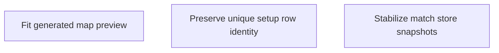

# State Tracker — SIGNAL LOSS / fix-generated-map

## Program / Feature / Intent / Sessions

| Field | Value |
|---|---|
| Program | **SIGNAL LOSS** (`signal-loss`) |
| Feature | `fix-generated-map` |
| Intent | Make the generated map preview show the complete centered board and remove the setup/match React console failures observed in the supplied screenshots, without changing deterministic map generation. |
| Sessions | 3 total |
| Program config | `./program/signal-loss/FORGE-CONFIG.md` |
| Prompt directory | `./program/signal-loss/prompts/fix-generated-map/` |

## Session Status

| # | Session | Modules | Owns | Status | Checkpoint | Completed | Notes |
|---|---|---|---|---|---|---|---|
| 01 | Fit the Generated Map Preview | M19, M22 | ./src/app/components/setup/MapPreview.tsx; ./tests/app/setup-screen/map-preview.test.tsx | done | 2/2 | 2026-08-28 | MapPreview viewBox derived from map.bounds via FX_ONE (2-unit margin); centered maps no longer clipped; regression added. Follow-up: Display margin is a fixed 2 board units on each side; boundary/wall/spawn stroke widths (.5/.8/.6) were kept verbatim and read slightly heavier in the ~68-unit viewport but remain fitted, not clipped. |
| 02 | Preserve Unique Setup Row Identity | M19, M22 | ./src/app/components/setup/RosterPicker.tsx; ./tests/app/setup-screen/roster-picker.test.tsx | done | 2/2 | 2026-08-28 | Excluded roster rows now key by stable source identity (saved-<id> / prebuilt-<id>); duplicate visible labels render as distinct React elements. Added focused unit regression. Follow-up: Stable excluded-row key format is saved-${SavedRosterV1.id} and prebuilt-${PrebuiltId}, matching the existing legal-choice key format ${kind}-${id}. Test inspects the returned React element tree directly (no jsdom) to prove key uniqueness before render. |

| 03 | Stabilize Match Store Snapshots | M17, M22 | ./src/app/store/match/context.tsx; ./tests/e2e/match/match-runtime-stability.spec.ts | done | 2/2 | 2026-08-28 | Moved useMatchStore snapshot cache inside getSnapshot (keyed by selector/equal/state) so derived selector arrays keep a stable reference for Reacts external-store contract; added a real setup-to-match browser regression. Follow-up: — |

## Wave Plan

| Wave | Sessions | Why concurrent |
|---|---|---|
| 1 | SESSION-01, SESSION-02, SESSION-03 | All three write sets are literally disjoint. They repair independent presentation, list-identity, and external-store boundary defects over already-shipped setup/match code; no session consumes an artifact produced by another. |

## Dependency Graph

## Architecture Reference

- `./src/engine/map/**` already emits valid continuous fixed-point coordinates centered around
  the origin. The setup preview must derive its SVG viewport from `GameMap.bounds`; it must not
  translate, clamp, or regenerate the map.
- `./src/app/components/setup/MapPreview.tsx` is a presentation consumer of `MapResult`. Its
  coordinate conversion is display-only and must use the engine's named fixed-point constant.
- `./src/app/components/setup/RosterPicker.tsx` keeps duplicate visible rows because excluded
  records are intentionally shown. React keys use stable source namespaces plus entity IDs, never
  display copy.
- `./src/app/store/match/context.tsx` is the React/Zustand boundary. `getSnapshot` must return a
  cached selected reference for an unchanged store state, and must apply the caller's equality
  function before handing a derived value to `useSyncExternalStore`.
- No session changes `./src/engine/map/**`, `./src/workers/**`, `./data/**`, persistence, routing,
  migrations, `./program/signal-loss/arch/**`, `./program/signal-loss/prompts/fix-generated-map/STATE.md`,
  or `./program/signal-loss/prompts/fix-generated-map/MASTER.md`.

## Scope Summary

| Module | Change |
|---|---|
| M17 — App state and bridge | Stabilize the match store's external-store snapshot getter so derived selector arrays do not trigger React's infinite update loop. |
| M19 — UI components | Fit the setup map preview to centered world coordinates and key excluded roster rows by stable source identity. |
| M22 — Verification tests | Add focused map-preview and roster-key unit coverage plus a real setup-to-match browser console regression. |

## Design Decisions

| Choice | Rationale |
|---|---|
| Fix the preview viewport, not map generation | The engine's centered negative coordinates are valid and the screenshot's clipped positive quadrant is caused by `viewBox="0 0 100 100"` in the setup component. |
| Keep map conversion in the setup component | The coordinate normalization is presentation-only; changing M08 or the worker would risk deterministic map hashes and is unnecessary. |
| Namespace excluded-row keys by source and ID | A saved roster and a prebuilt can intentionally share the same display name and exclusion text; both rows must remain visible with unique React identity. |
| Cache before `useSyncExternalStore` | The existing equality cache runs too late to satisfy React when `constructsOfSquad` returns a fresh array. The shared hook is the correct boundary and preserves all consumers. |
| Use a browser regression for the match error | Static rendering cannot exercise React's live external-store subscription; the supplied console failure must be verified through the real setup-to-match route. |
| No new package or product retry | The defect is local to existing React/Zustand integration. Installing a selector package or retrying generation would add scope and could hide failures. |

## Handoff Notes (Jikijitsu writes here after each session — from Mu's handoff JSON, verbatim)

### SESSION-01

{
  "session": "01",
  "status": "done",
  "checkpoint": 2,
  "notes": "MapPreview viewBox derived from map.bounds via FX_ONE (2-unit margin); centered maps no longer clipped; regression added.",
  "delivered": "Rewrote ./src/app/components/setup/MapPreview.tsx to compute a PreviewViewBox from map.bounds in board units (FX_ONE conversion, PREVIEW_MARGIN=2, preserveAspectRatio=xMidYMid meet), replacing viewBox='0 0 100 100' and all /1024 literals; added ./tests/app/setup-screen/map-preview.test.tsx.",
  "verification": "npx vitest run ./tests/app/setup-screen/map-preview.test.tsx -> 4 pass; npm run typecheck -> pass; npm run lint -> pass",
  "surprises": "Working tree showed concurrent edits to src/app/store/match/context.tsx (SESSION-03's lease) and an interleaved SESSION-02 commit during my run; neither touched by me — expected under orchestration.",
  "followUp": "Display margin is a fixed 2 board units on each side; boundary/wall/spawn stroke widths (.5/.8/.6) were kept verbatim and read slightly heavier in the ~68-unit viewport but remain fitted, not clipped.",
  "filesTouched": ["src/app/components/setup/MapPreview.tsx", "tests/app/setup-screen/map-preview.test.tsx"],
  "blockedReason": null
}

### SESSION-02
{
  "session": "02",
  "status": "done",
  "checkpoint": 2,
  "notes": "Excluded roster rows now key by stable source identity (saved-<id> / prebuilt-<id>); duplicate visible labels render as distinct React elements. Added focused unit regression.",
  "delivered": "RosterPicker excluded accumulator changed from string[] to an internal ExcludedRosterRow {key,label} record; rows render with key={row.key} using saved-${saved.id}/prebuilt-${prebuilt.id} namespaces. Iteration order, labels, legality-message selection, and the EXCLUDED — SHOWN, NEVER HIDDEN surface are unchanged. New test asserts two identical 'SCOUT PATROL · NOT BUILT AT 100' labels produce two visible rows with distinct source-derived keys, and a legal prebuilt choice is still keyed by its source identity.",
  "verification": "npx vitest run ./tests/app/setup-screen/roster-picker.test.tsx → 3 pass; npm run typecheck → pass; npm run lint → pass. Duplicate console-warning label 'SCOUT PATROL · NOT BUILT AT 100' now yields keys saved-roster:1 and prebuilt-prebuilt:scout (unique).",
  "surprises": "The concurrent sessions share one git index: tests/e2e/match/match-runtime-stability.spec.ts (SESSION-03's lease) was already staged in the index when I committed. I used explicit pathspec commits (git commit -m ... -- <path>) so my commits contain only my two lease files; git show confirms the SESSION-03 spec is not in either of my commits. I left that staged file untouched.",
  "followUp": "Stable excluded-row key format is `saved-${SavedRosterV1.id}` and `prebuilt-${PrebuiltId}`, matching the existing legal-choice key format `${kind}-${id}`. Test inspects the returned React element tree directly (no jsdom) to prove key uniqueness before render.",
  "filesTouched": ["src/app/components/setup/RosterPicker.tsx", "tests/app/setup-screen/roster-picker.test.tsx"],
  "blockedReason": null
}

### SESSION-03
{
  "session": "03",
  "status": "done",
  "checkpoint": 2,
  "notes": "Moved useMatchStore snapshot cache inside getSnapshot (keyed by selector/equal/state) so derived selector arrays keep a stable reference for React's external-store contract; added a real setup-to-match browser regression.",
  "delivered": "Referentially-stable getSnapshot in src/app/store/match/context.tsx (fixes SquadRail getSnapshot/maximum-update-depth loop) plus tests/e2e/match/match-runtime-stability.spec.ts driving the real /#/setup -> DEPLOY -> /#/match route.",
  "verification": "npm run typecheck pass; npm run lint pass; npx vitest run tests/app/match/shell.test.tsx tests/app/match/match-launch.test.tsx -> 9 pass; npx playwright test tests/e2e/match/match-runtime-stability.spec.ts --project=chromium --project=firefox --project=webkit -> 3 pass. Deterministic map seed 8592953eb8ce193f7fcdc987660b5fab at default budget 100 with the STRIKE FORCE prebuilt.",
  "surprises": "The 'Own constructs' accessible name is present on two elements (the squad-rail div and the accessible-mirror section), so the test locates the section via role=region to stay unambiguous; getByLabel does not match a plain div's aria-label. Concurrent SESSION-01/02 committed their own lease files (MapPreview.tsx, RosterPicker.tsx, STATE.md) during this run — expected under orchestration, not touched by me.",
  "followUp": "—",
  "filesTouched": ["src/app/store/match/context.tsx", "tests/e2e/match/match-runtime-stability.spec.ts"],
  "blockedReason": null
}
