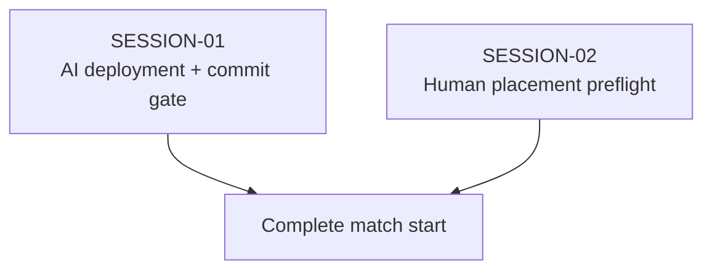

# State Tracker — SIGNAL LOSS / fix-match-start

## Program / Feature / Intent / Sessions

- **Program:** SIGNAL LOSS (`signal-loss`)
- **Feature:** `fix-match-start`
- **Intent:** Make deployment start a real match: reject footprint-overlapping human placements before commit, request and await all four AI deployments, and transition to movement only after the engine accepts the complete five-squad deployment.
- **Sessions:** SESSION-01 wires the existing AI worker path and the human-plus-AI commit gate. SESSION-02 delegates live human placement legality to the existing engine authority.

## Session Status

| # | Session | Modules | Owns | Status | Checkpoint | Completed | Notes |
|---|---|---|---|---|---|---|---|
| 01 | Wire AI Deployment Into Match Start | M02, M17, M19, M20, M22 | `./data/ai.weights.json`, `./src/app/bridge/ai-client.ts`, `./src/app/store/match/ai-config.ts`, `./src/app/store/match/ai-deployment.ts`, `./src/app/store/match/match-store.ts`, `./src/app/components/match/CommandBar.tsx`, `./src/app/screens/match/MatchScreen.tsx`, `./tests/app/match/ai-deployment.test.ts`, `./tests/app/match/command-bar.test.tsx`, `./tests/app/match/match-start.test.ts`, `./tests/app/match/deployment-mode.test.tsx`, `./tests/e2e/match/deployment-placement.spec.ts` | in-progress | 0/4 | — | Launched in Zen Wave 1, slot 1. |
| 02 | Preflight Human Deployment Footprints | M20, M22 | `./src/app/screens/match/deployment-placement.ts`, `./src/app/screens/match/DeploymentMode.tsx`, `./tests/app/match/deployment-placement.test.ts` | in-progress | 0/2 | — | Launched in Zen Wave 1, slot 2. |

## Wave Plan

| Wave | Sessions | Why concurrent |
|---|---|---|
| 1 | SESSION-01, SESSION-02 | Both have no dependencies and their write sets are disjoint. SESSION-01 owns the AI/start gate, tests, and browser acceptance; SESSION-02 owns only the human placement adapter/screen and its focused test. SESSION-02 has no browser resource, so it does not contend for SESSION-01's `port:5173` or `/tmp/signal-loss-e2e`. |

## Dependency Graph

## Architecture Reference (feature-specific only; full config in `./program/signal-loss/FORGE-CONFIG.md`)

- **Engine authority:** `./src/engine/match/deployment.ts` remains unchanged and owns spawn, wall, footprint, cross-squad, completeness, and simultaneous-reveal legality.
- **AI boundary:** `./src/app/store/match/ai-deployment.ts` constructs only `AI_DEPLOY` requests with `publicView(...)`; human drafts never enter `PublicState`, worker requests, or engine state.
- **Worker lifecycle:** `./src/app/bridge/ai-client.ts` remains an injected/cancellable transport. `./src/app/screens/match/MatchScreen.tsx` owns the browser worker client for the mounted deployment run and disposes it when the mode changes or the screen unmounts.
- **Readiness:** `./src/app/store/match/match-store.ts` is defensively gated on all four `READY_DEPLOY` slots, while `./src/app/components/match/CommandBar.tsx` uses the same predicate for mouse and keyboard actions.
- **Authored AI input:** `./data/ai.weights.json` is a bundled app input validated by `./src/app/store/match/ai-config.ts`; the deployment request uses a small fixed node budget because `aiDeploy` treats the budget as candidates per construct. This is separate from the catalog's rule tunables and from the test fixture.
- **Human preflight:** `./src/app/screens/match/deployment-placement.ts` delegates to `legalDeployment()` and ignores only `PARTIAL_DEPLOYMENT` during incremental staging.

## Scope Summary

| Module | Affected paths | Change |
|---|---|---|
| M02 | `./data/ai.weights.json` | Add the static release AI coefficients and deployment budget. |
| M17 | `./src/app/bridge/ai-client.ts`, `./src/app/store/match/ai-config.ts`, `./src/app/store/match/ai-deployment.ts`, `./src/app/store/match/match-store.ts` | Add production AI input loading, match-entry orchestration, and a no-partial-commit guard. |
| M20 | `./src/app/screens/match/MatchScreen.tsx`, `./src/app/screens/match/DeploymentMode.tsx`, `./src/app/screens/match/deployment-placement.ts` | Mount AI lifecycle and make human placement use engine-backed preflight. |
| M19 | `./src/app/components/match/CommandBar.tsx` | Disable `BEGIN MATCH` until human and AI deployments are ready; show truthful status. |
| M22 | `./tests/app/match/ai-deployment.test.ts`, `./tests/app/match/command-bar.test.tsx`, `./tests/app/match/match-start.test.ts`, `./tests/app/match/deployment-mode.test.tsx`, `./tests/app/match/deployment-placement.test.ts`, `./tests/e2e/match/deployment-placement.spec.ts` | Cover coordinator, store boundary, UI gate, overlap feedback, and the real browser transition. |

## Design Decisions

1. **Start AI deployment on match mount:** post one request for each launch AI squad in parallel. The existing worker client is the transport; no setup rerun, hidden seed, retry loop, or direct engine AI call is introduced.
2. **Require all five squads before commit:** human drafts must be complete and every AI slot must be `READY_DEPLOY`. The button gate is UX; the store guard is the safety boundary; the engine remains final authority.
3. **Use static validated AI data:** copy the existing release coefficients into `./data/ai.weights.json` because the worker contract requires `AiWeights` and production has no app-side source. Validate at the browser boundary rather than importing `./tests/harness/support/ai-weights.ts` or adding values to engine rule state.
4. **Use `deploymentNodeBudget: 64`:** `aiDeploy()` interprets `nodeBudget` as candidate samples per construct, so passing the large tier-2/3 movement budgets would create an unnecessary deployment cost. The selected tier is still passed through the protocol; deployment policy remains legal and deterministic.
5. **Delegate placement legality:** the UI calls `legalDeployment()` with staged entries plus the candidate and filters only `PARTIAL_DEPLOYMENT`. This prevents the screenshot's near-overlap from reaching the commit banner and avoids a second geometry implementation.
6. **Preserve cancellation and information boundaries:** AI results write only typed slot state, stale results are ignored after cancellation, and drafts remain app-local. No runtime network or persistence is added.

## Handoff Notes (Jikijitsu writes here after each session — from Mu's handoff JSON, verbatim)
