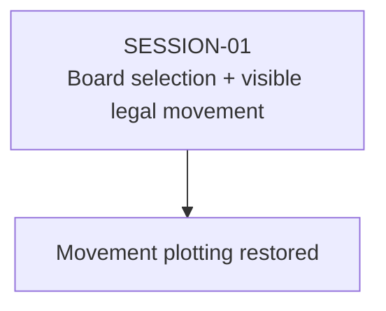

# State Tracker — SIGNAL LOSS / fix-movement-plotting

## Program / Feature / Intent / Sessions

- **Program:** SIGNAL LOSS (`signal-loss`)
- **Feature:** `fix-movement-plotting`
- **Intent:** Restore the first playable movement interaction after deployment: canvas marker selection must work, legal waypoint drafts must render from store truth, and committing one must produce a real positive-distance movement event.
- **Sessions:** One coherent session repairs the shared board/screen boundary and extends the existing setup-to-deployment browser regression through movement resolution.

## Session Status

| # | Session | Modules | Owns | Status | Checkpoint | Completed | Notes |
|---|---|---|---|---|---|---|---|
| 01 | Restore Movement Plot Interaction | M18, M20, M22 | `./src/app/board/BoardCanvas.tsx`, `./src/app/screens/match/MovementMode.tsx`, `./tests/e2e/match/deployment-placement.spec.ts` | in-progress | 0/3 | — | Canvas hit ids are currently discarded and movement overlay drafts are hard-coded empty. |

## Wave Plan

| Wave | Sessions | Why concurrent |
|---|---|---|
| 1 | SESSION-01 | Single member: the pointer contract, movement-mode routing, and browser proof share the same board/screen interaction surface. Splitting them would create a lossy handoff rather than a disjoint lease. |

## Dependency Graph

## Architecture Reference

- **Rule authority:** `./src/engine/match/plot.ts` remains unchanged; `legalMovePlot()` validates and normalizes every candidate before it reaches app drafts.
- **Draft boundary:** `./src/app/store/match/match-store.ts` remains unchanged; selection, hover, and `moveDrafts` stay app-local and outside engine/public/worker state.
- **Board responsibility:** `./src/app/board/BoardCanvas.tsx` converts pointer coordinates once, identifies the hit construct arithmetically, and supplies render facts; it does not decide phase semantics.
- **Screen responsibility:** `./src/app/screens/match/MovementMode.tsx` decides whether a pointer hit selects, inspects, or appends a legal waypoint.
- **Acceptance path:** `./tests/e2e/match/deployment-placement.spec.ts` already owns the real setup → five-squad deployment → movement transition and is extended rather than duplicated.

## Scope Summary

| Module | Affected paths | Change |
|---|---|---|
| M18 | `./src/app/board/BoardCanvas.tsx` | Return hit context and replace the empty movement-overlay placeholder with selected store draft truth. |
| M20 | `./src/app/screens/match/MovementMode.tsx` | Restore canvas selection, safe waypoint editing, hover feedback, and immediate engine-backed rejection. |
| M22 | `./tests/e2e/match/deployment-placement.spec.ts` | Prove the real deployed construct can be selected, plotted, committed, and observed moving across all supported browsers. |

## Design Decisions

1. **One session, not separate renderer/screen/test sessions:** all three changes form one pointer-to-engine path and the test depends on both source edits. There is no disjoint write set worth parallelizing.
2. **Board reports hits; mode assigns meaning:** this avoids breaking deployment or attack behavior with a global canvas selection side effect.
3. **No second draft model:** the overlay reads M17’s existing `moveDrafts` map; React-local state is limited to human-readable rejection feedback.
4. **Engine-normalized paths only:** the mode stores `legalMovePlot().value.path`; rejected candidates never replace the last valid path or silently become HOLD.
5. **Positive outcome over surface presence:** browser acceptance does not stop at seeing `MOVEMENT_PLOT`; it commits a waypoint and requires a positive-distance `MOVED` event.
6. **No engine, schema, AI, or attack changes:** those paths are read-only for this defect and are absent from the lease.

## Handoff Notes
