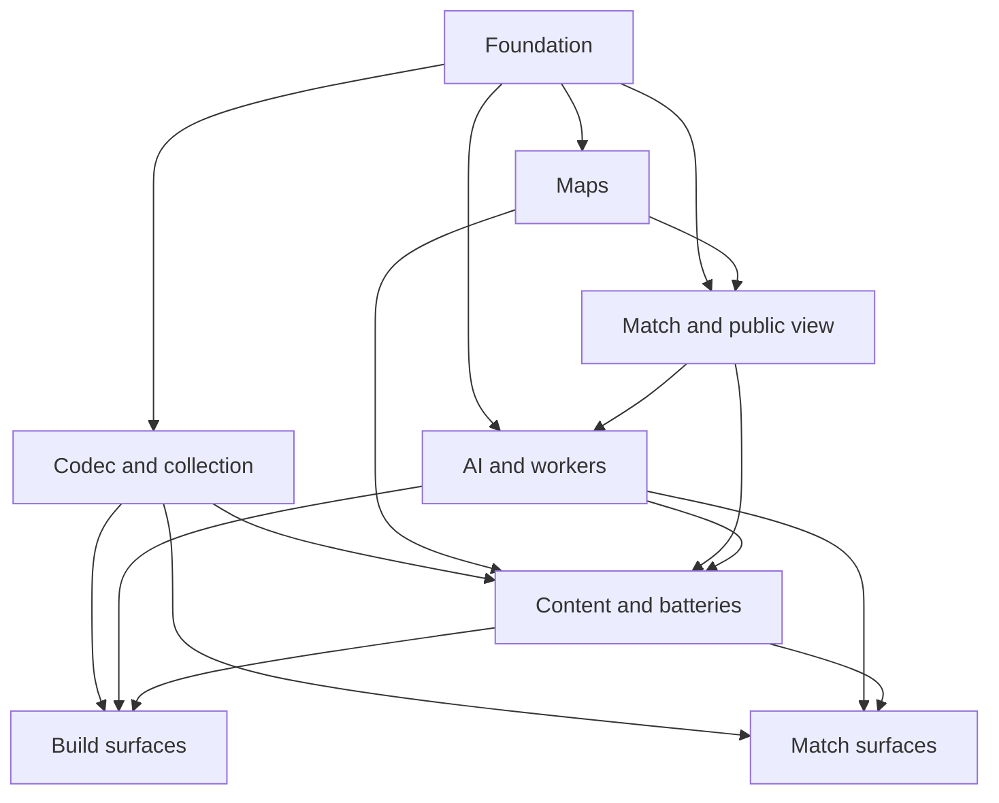

# State Tracker — SIGNAL LOSS / full-v1

## Program / Feature / Intent / Sessions

| Field | Value |
|---|---|
| Program | **SIGNAL LOSS** (`signal-loss`) |
| Feature | `full-v1` |
| Intent | Build the complete deterministic simultaneous-turn browser tactics game defined by the approved Genesis handoff, with no feature cuts. |
| Sessions | 8 total |
| Program config | `./program/signal-loss/FORGE-CONFIG.md` |
| Prompt directory | `./program/signal-loss/prompts/full-v1/` |

## Session Status

| # | Session | Modules | Owns | Status | Checkpoint | Completed | Notes |
|---|---|---|---|---|---|---|---|
| 01 | Deterministic Foundation and Build Rules | M01, M03, M04, M05, M06, M21, M22 | `./package.json` `./package-lock.json` `./tsconfig.json` `./tsconfig.app.json` `./tsconfig.node.json` `./vite.config.ts` `./vitest.config.ts` `./playwright.config.ts` `./eslint.config.js` `./index.html` `./public/icon.svg` `./src/vite-env.d.ts` `./src/app/main.tsx` `./src/app/route-registry.tsx` `./src/app/styles.css` `./src/engine/fx/**` `./src/engine/rng/**` `./src/engine/catalog/**` `./src/engine/build/**` `./tests/setup/**` `./tests/fixtures/catalog/**` `./tests/engine/fx/**` `./tests/engine/rng/**` `./tests/engine/catalog/**` `./tests/engine/build/**` | in-progress | — | — | |
| 02 | Offline Collection, Codec, and Shared App Primitives | M07, M13, M14, M17, M19, M22 | `./src/engine/codec/**` `./src/platform/**` `./src/app/components/shared/**` `./src/app/store/core/**` `./tests/engine/codec/**` `./tests/platform/**` `./tests/app/core/**` | pending | — | — | |
| 03 | Procedural Maps and Playability Gate | M08, M22 | `./src/engine/map/**` `./tests/engine/map/**` `./tests/fixtures/maps/**` | pending | — | — | |
| 04 | Deterministic Match Resolution and Public Projection | M09, M10, M22 | `./src/engine/match/**` `./src/engine/view/**` `./tests/engine/match/**` `./tests/engine/view/**` `./tests/fixtures/matches/**` | pending | — | — | |
| 05 | Fair Tiered AI, Workers, and Engine Facade | M11, M12, M15, M22 | `./src/engine/ai/**` `./src/engine/index.ts` `./src/workers/**` `./tests/engine/ai/**` `./tests/engine/facade/**` `./tests/workers/**` `./tests/fixtures/ai/**` | pending | — | — | |
| 06 | Release Content, Headless Batteries, and CI Gates | M01, M02, M16, M22 | `./data/catalog.chassis.json` `./data/catalog.mounts.json` `./data/catalog.commanders.json` `./data/catalog.prebuilts.json` `./data/tunables.json` `./data/map.archetypes.json` `./harness/**` `./tests/harness/**` `./docs/verification/**` `./.github/workflows/ci.yml` | pending | — | — | |
| 07 | Build Zone, Setup, Codex, and Result Surfaces | M02, M07, M14, M17, M19, M20, M22 | `./src/app/bridge/mapgen-client.ts` `./src/app/store/build/**` `./src/app/components/build/**` `./src/app/components/setup/**` `./src/app/components/result/**` `./src/app/screens/boot/**` `./src/app/screens/build/**` `./src/app/screens/codex/**` `./src/app/screens/setup/**` `./src/app/screens/result/**` `./tests/app/build/**` `./tests/e2e/build/**` | pending | — | — | |
| 08 | Match Shell, Board, Plotting, and Playback | M09, M10, M11, M15, M17, M18, M19, M20, M22 | `./src/app/bridge/ai-client.ts` `./src/app/store/match/**` `./src/app/board/**` `./src/app/components/match/**` `./src/app/screens/match/**` `./tests/app/match/**` `./tests/e2e/match/**` | pending | — | — | |

Status values: `pending` · `in-progress` · `done` · `blocked` · `skipped`. **Checkpoint** is the last checkpoint actually committed, verified against `git log --oneline -- <lease paths>`.

## Wave Plan

| Wave | Sessions | Why concurrent |
|---|---|---|
| 1 | SESSION-01 | Single foundation lease: every later session reads its toolchain, bootstrap, math, catalog schema, or build rules. |
| 2 | SESSION-02, SESSION-03 | Codec/platform/shared app paths and map-engine paths are literally disjoint; both need only Session 01 artifacts. |
| 3 | SESSION-04 | Match state/resolution needs the completed map contract; it owns the shared match/view state every downstream consumer reads. |
| 4 | SESSION-05 | AI, workers, and the final engine facade require the completed match/public-view artifact. |
| 5 | SESSION-06 | Release content and all headless gates need the complete engine; both UI halves then consume its final data/hashes. |
| 6 | SESSION-07, SESSION-08 | Build/setup/result and match/board own separate bridge, store, component, screen, and test paths; both consume only prior-wave shared contracts. |

## Dependency Graph

## Architecture Reference

- **Authoritative full config:** `./program/signal-loss/FORGE-CONFIG.md`.
- **Feature invariant:** one pure dependency-free deterministic engine; browser and Node harness are clients.
- **Information invariant:** AI receives only squad-specific `PublicState`; intent is the only hidden fact.
- **Numeric invariant:** fixed-point integer geometry and integer rule arithmetic; movement uses 64 fixed substeps.
- **Persistence invariant:** `./src/migrations/**` is permanently DB-owned and never appears in a session lease.
- **Delivery invariant:** static/offline, self-hosted assets, CSP `connect-src 'none'`, no backend or telemetry.
- **Design source:** `./specs/design.md` and `./mocks/*.html`; release catalog values come from Session 06, not mock placeholders.

## Scope Summary

| Modules | Scope |
|---|---|
| M01–M02 | Strict build/CI and release-authored JSON content. |
| M03–M07 | Fixed math, seeded streams, catalog/build legality, and versioned share codec. |
| M08–M12 | Procedural maps, deterministic match pipeline, public fog projection, fair tiered AI, and engine facade. |
| M13–M16 | Read-only DB schema, browser adapters, worker entries, and full headless acceptance harness. |
| M17–M21 | App stores/bridges, layered board, semantic components, eleven screens, stable app shell/PWA. |
| M22 | Unit, engine, worker, harness, browser, accessibility, determinism, performance, and offline verification. |

## Design Decisions

| Choice | Rationale |
|---|---|
| Route discovery is stabilized in Session 01. | Concurrent UI sessions can add disjoint routes without reopening a shared registry/bootstrap file. |
| Release content and batteries share Session 06. | Tuning modifies the same `./data/*.json` files; splitting them would create a serial merge loop across one write set. |
| Match state and public projection share Session 04. | Both own the same state/known-position/event contracts; a split would repeatedly edit shared files. |
| Codec, persistence adapters, core flow state, and shared controls share Session 02. | They form the browser's typed external-data boundary and provide the stable contracts both UI halves need. |
| Build/setup/result and match/board are separate Session 07/08 leases. | Their paths are disjoint and the combined visual working set exceeds one context window; they can run concurrently after shared artifacts land. |
| Browser test artifacts go under session-specific `/tmp` directories. | Concurrent Playwright runs do not collide and generated evidence never enters a Mu checkpoint pathspec. |

## Handoff Notes
