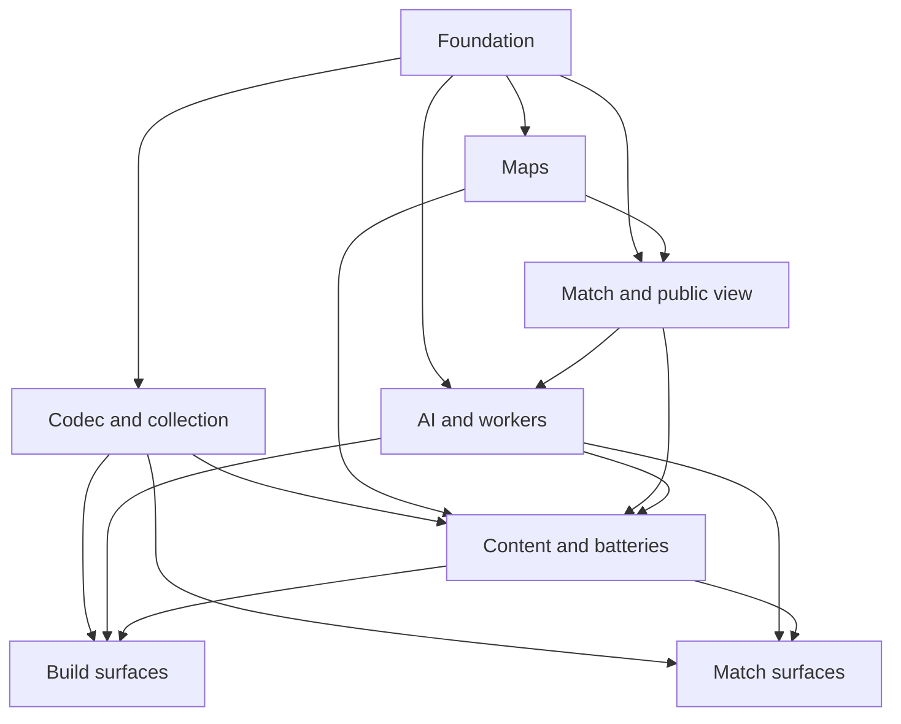

# State Tracker — SIGNAL LOSS / full-v1

## Program / Feature / Intent / Sessions

| Field | Value |
|---|---|
| Program | **SIGNAL LOSS** (`signal-loss`) |
| Feature | `full-v1` |
| Intent | Build the complete deterministic simultaneous-turn browser tactics game defined by the approved Genesis handoff, with no feature cuts. |
| Sessions | 8 total |
| Program config | `./program/signal-loss/FORGE-CONFIG.md` |
| Prompt directory | `./program/signal-loss/prompts/full-v1/` |

## Session Status

| # | Session | Modules | Owns | Status | Checkpoint | Completed | Notes |
|---|---|---|---|---|---|---|---|
| 01 | Deterministic Foundation and Build Rules | M01, M03, M04, M05, M06, M21, M22 | `./package.json` `./package-lock.json` `./tsconfig.json` `./tsconfig.app.json` `./tsconfig.node.json` `./vite.config.ts` `./vitest.config.ts` `./playwright.config.ts` `./eslint.config.js` `./index.html` `./public/icon.svg` `./src/vite-env.d.ts` `./src/app/main.tsx` `./src/app/route-registry.tsx` `./src/app/styles.css` `./src/engine/fx/**` `./src/engine/rng/**` `./src/engine/catalog/**` `./src/engine/build/**` `./tests/setup/**` `./tests/fixtures/catalog/**` `./tests/engine/fx/**` `./tests/engine/rng/**` `./tests/engine/catalog/**` `./tests/engine/build/**` | done | 5/5 | 2026-08-28 | Delivered the deterministic foundation: strict TS 5.7 + React 19 + Vite 6 + Vitest 3 + Tailwind v4 toolchain with ESLint engine-purity and boundary rules; Fx branded fixed-point math and geometry primitives; PCG32 seeded RNG with independent named streams; catalog schema/validate/canonical-hash with full path-specific error reporting; and the shared build/legality/enumeration surface FR-1..FR-5 requires. 5/5 checkpoints committed; 185 unit tests pass; strict CSP `connect-src 'none'` in production HTML; no runtime network dependency in dist/. |
| 02 | Offline Collection, Codec, and Shared App Primitives | M07, M13, M14, M17, M19, M22 | `./src/engine/codec/**` `./src/platform/**` `./src/app/components/shared/**` `./src/app/store/core/**` `./tests/engine/codec/**` `./tests/platform/**` `./tests/app/core/**` | done | 5/5 | 2026-08-28 | Delivered SL1 codec (bitstream, encode/decode, four distinguishable failure kinds, byte-padded FNV-1a-16 checksum), CollectionRepository over the DB-owned migration with all nine RepositoryError discriminants + atomic mutation flow (STALE_REVISION, one setItem per success, canonical mount order), Zustand vanilla core stores (collection/navigation/preferences/flow with MatchLaunchConfig+MatchResultPayload handoff), clipboard + capability adapters (name-agnostic quota detection), and 13 shared semantic components. 5/5 checkpoints committed; 127 session-02 unit tests pass alongside the existing 297 (total 424); typecheck + lint + build clean; migration file byte-identical. |
| 03 | Procedural Maps and Playability Gate | M08, M22 | `./src/engine/map/**` `./tests/engine/map/**` `./tests/fixtures/maps/**` | done | 4/4 | 2026-08-28 | Delivered M08 procedural map generation + FR-11 playability gate: continuous fx geometry, deterministic wall spatial index with sorted-by-id queries, seven seeded archetypes with isolated named RNG streams (walls/hazards/spawns/trace/cosmetic), monotone-nested trace schedules, coarse analysis grid (zero rule authority) driving all seven FR-11 checks with per-check evidence, generate→gate→retry loop with #regen<n> derived seeds and MaxRegenExceededError defect surfacing. 4/4 checkpoints committed; 112 unit tests pass (including a 100-map × 2-run repeatability probe hashing both accepted maps and rejection sequences); no engine boundary violation. |
| 04 | Deterministic Match Resolution and Public Projection | M09, M10, M22 | `./src/engine/match/**` `./src/engine/view/**` `./tests/engine/match/**` `./tests/engine/view/**` `./tests/fixtures/matches/**` | done | 6/6 | 2026-08-28 | Delivered M09 match resolution + M10 public projection: plain structurally-cloneable MatchState with sorted-by-id arrays + FNV-1a-64 canonical hashing, deployment reveal, 64-substep movement with symmetric halt fixed point (structural FR-15 order independence), one-implementation exchange preview + resolveAttackStage, poolFor with FR-17 breakdown + permanent commanderDead flag, trace/destruction/AD-4-tiebroken elimination, resolveRound composing resolveMovementPhase + resolveAttackPhase, PublicState as a whitelist type (never Omit) with per-observer knownPositions + drift ghosts, MatchLog v1 fold with fail-loud catalog/tunables hash guards. 6/6 checkpoints committed; 512 tests pass (88 new session-04 tests including 120-permutation invariance on movement, attack, resolveRound, and foldMatchLog); typecheck + lint + build clean; no engine/rng or npm imports; every engine file passes the purity grep (no Math.random / Date / performance.now). |
| 05 | Fair Tiered AI, Workers, and Engine Facade | M11, M12, M15, M22 | `./src/engine/ai/**` `./src/engine/index.ts` `./src/workers/**` `./tests/engine/ai/**` `./tests/engine/facade/**` `./tests/workers/**` `./tests/fixtures/ai/**` | done | 5/5 | 2026-08-28 | Delivered M11 AI + M12 engine facade + M15 workers: shared derived-stat evaluator with three tiers (Tier 1 greedy + data-driven called/posture rates; Tier 2 opponent posture-frequency blends the FLAT/POSTURE matrix cells via Beta-Bernoulli-smoothed observations; Tier 3 anti-kingmaking damage penalty + trace-schedule lookahead), deterministic AI roster/deployment/candidate generators, seeded stable tie-breaks with (score * 1024 + nonce) composite, exact NodeBudget accounting, engine facade exposing Fx/RNG/Catalog/Build/Codec/Map/Match/View/AI as the single supported browser/worker/harness surface, and typed structurally-cloneable WorkerRequest/Response protocol whose AI variants accept PublicState (never MatchState — compile-time property with negative fixture). 5/5 checkpoints committed; 74 new session-05 tests pass alongside the existing suite; typecheck + lint + build clean; the engine module imports no npm dependency, no ./src/app, no ./src/platform, and no ./src/workers path. |
| 06 | Release Content, Headless Batteries, and CI Gates | M01, M02, M16, M22 | `./data/catalog.chassis.json` `./data/catalog.mounts.json` `./data/catalog.commanders.json` `./data/catalog.prebuilts.json` `./data/tunables.json` `./data/map.archetypes.json` `./harness/**` `./tests/harness/**` `./docs/verification/**` `./.github/workflows/ci.yml` | pending | — | — | |
| 07 | Build Zone, Setup, Codex, and Result Surfaces | M02, M07, M14, M17, M19, M20, M22 | `./src/app/bridge/mapgen-client.ts` `./src/app/store/build/**` `./src/app/components/build/**` `./src/app/components/setup/**` `./src/app/components/result/**` `./src/app/screens/boot/**` `./src/app/screens/build/**` `./src/app/screens/codex/**` `./src/app/screens/setup/**` `./src/app/screens/result/**` `./tests/app/build/**` `./tests/e2e/build/**` | pending | — | — | |
| 08 | Match Shell, Board, Plotting, and Playback | M09, M10, M11, M15, M17, M18, M19, M20, M22 | `./src/app/bridge/ai-client.ts` `./src/app/store/match/**` `./src/app/board/**` `./src/app/components/match/**` `./src/app/screens/match/**` `./tests/app/match/**` `./tests/e2e/match/**` | pending | — | — | |

Status values: `pending` · `in-progress` · `done` · `blocked` · `skipped`. **Checkpoint** is the last checkpoint actually committed, verified against `git log --oneline -- <lease paths>`.

## Wave Plan

| Wave | Sessions | Why concurrent |
|---|---|---|
| 1 | SESSION-01 | Single foundation lease: every later session reads its toolchain, bootstrap, math, catalog schema, or build rules. |
| 2 | SESSION-02, SESSION-03 | Codec/platform/shared app paths and map-engine paths are literally disjoint; both need only Session 01 artifacts. |
| 3 | SESSION-04 | Match state/resolution needs the completed map contract; it owns the shared match/view state every downstream consumer reads. |
| 4 | SESSION-05 | AI, workers, and the final engine facade require the completed match/public-view artifact. |
| 5 | SESSION-06 | Release content and all headless gates need the complete engine; both UI halves then consume its final data/hashes. |
| 6 | SESSION-07, SESSION-08 | Build/setup/result and match/board own separate bridge, store, component, screen, and test paths; both consume only prior-wave shared contracts. |

## Dependency Graph

## Architecture Reference

- **Authoritative full config:** `./program/signal-loss/FORGE-CONFIG.md`.
- **Feature invariant:** one pure dependency-free deterministic engine; browser and Node harness are clients.
- **Information invariant:** AI receives only squad-specific `PublicState`; intent is the only hidden fact.
- **Numeric invariant:** fixed-point integer geometry and integer rule arithmetic; movement uses 64 fixed substeps.
- **Persistence invariant:** `./src/migrations/**` is permanently DB-owned and never appears in a session lease.
- **Delivery invariant:** static/offline, self-hosted assets, CSP `connect-src 'none'`, no backend or telemetry.
- **Design source:** `./specs/design.md` and `./mocks/*.html`; release catalog values come from Session 06, not mock placeholders.

## Scope Summary

| Modules | Scope |
|---|---|
| M01–M02 | Strict build/CI and release-authored JSON content. |
| M03–M07 | Fixed math, seeded streams, catalog/build legality, and versioned share codec. |
| M08–M12 | Procedural maps, deterministic match pipeline, public fog projection, fair tiered AI, and engine facade. |
| M13–M16 | Read-only DB schema, browser adapters, worker entries, and full headless acceptance harness. |
| M17–M21 | App stores/bridges, layered board, semantic components, eleven screens, stable app shell/PWA. |
| M22 | Unit, engine, worker, harness, browser, accessibility, determinism, performance, and offline verification. |

## Design Decisions

| Choice | Rationale |
|---|---|
| Route discovery is stabilized in Session 01. | Concurrent UI sessions can add disjoint routes without reopening a shared registry/bootstrap file. |
| Release content and batteries share Session 06. | Tuning modifies the same `./data/*.json` files; splitting them would create a serial merge loop across one write set. |
| Match state and public projection share Session 04. | Both own the same state/known-position/event contracts; a split would repeatedly edit shared files. |
| Codec, persistence adapters, core flow state, and shared controls share Session 02. | They form the browser's typed external-data boundary and provide the stable contracts both UI halves need. |
| Build/setup/result and match/board are separate Session 07/08 leases. | Their paths are disjoint and the combined visual working set exceeds one context window; they can run concurrently after shared artifacts land. |
| Browser test artifacts go under session-specific `/tmp` directories. | Concurrent Playwright runs do not collide and generated evidence never enters a Mu checkpoint pathspec. |

## Handoff Notes

### SESSION-01

- **Status:** done
- **Checkpoint:** 5/5
- **Notes:** Delivered the deterministic foundation: strict TS 5.7 + React 19 + Vite 6 + Vitest 3 + Tailwind v4 toolchain with ESLint engine-purity and boundary rules; Fx branded fixed-point math and geometry primitives; PCG32 seeded RNG with independent named streams; catalog schema/validate/canonical-hash with full path-specific error reporting; and the shared build/legality/enumeration surface FR-1..FR-5 requires. 5/5 checkpoints committed; 185 unit tests pass; strict CSP `connect-src 'none'` in production HTML; no runtime network dependency in dist/.
- **Follow-up:** Session 02 codec should reuse the same FNV-1a-64 pattern (canonicalize + hash) with a wire-format checksum. Session 06 owns the release ./data/*.json content and can copy the fixture shape but must tune values through the FR-31 costing battery. The route-registry test simulates modules as plain objects to stay node-runtime; when Session 07/08 add real screens with hooks, they should add `// @vitest-environment jsdom` at the top of their render tests. Battery scripts (test:determinism/playability/behavior/costing) currently use `--passWithNoTests` and print `no test files found` explicitly — Session 06 must remove that flag from the ones it owns as it adds real tests. The engine no-restricted-imports deny list must be updated whenever a new npm dependency lands.

### SESSION-02

- **Status:** done
- **Checkpoint:** 5/5
- **Notes:** Delivered SL1 codec (bitstream, encode/decode, four distinguishable failure kinds, byte-padded FNV-1a-16 checksum), CollectionRepository over the DB-owned migration with all nine RepositoryError discriminants + atomic mutation flow (STALE_REVISION, one setItem per success, canonical mount order), Zustand vanilla core stores (collection/navigation/preferences/flow with MatchLaunchConfig+MatchResultPayload handoff), clipboard + capability adapters (name-agnostic quota detection), and 13 shared semantic components. 5/5 checkpoints committed; 127 session-02 unit tests pass alongside the existing 297 (total 424); typecheck + lint + build clean; migration file byte-identical.
- **Follow-up:** Session 07/08 will need jsdom + @testing-library/react to layer full keyboard/focus tests on top of the shared components. Session-02 tests use react-dom/server renderToStaticMarkup to cover roles, aria attributes, disabled state, and label associations without a DOM — sufficient for the primitives shipped but not for interactive keyboard verification the design.md §5.5 armed-destructive pattern will require in the composer. Also: (a) MatchLaunchConfig / MatchResultPayload types are minimal handoff CONTRACTS — Sessions 07 (setup/result) and 08 (match) will extend them under their own store subpaths and MUST NOT persist them via CollectionRepository (they are transient by design). (b) preloadMigrationModule() must be called once at app boot before creating any CollectionRepository — the boot path/appShell should await it. (c) The DB follow-up above is a soft blocker for anyone else who needs to statically import ./src/migrations/001_initial.ts; until DB reissues, use the migration-runtime shim.

### SESSION-03

- **Status:** done
- **Checkpoint:** 4/4
- **Notes:** Delivered M08 procedural map generation + FR-11 playability gate: continuous fx geometry, deterministic wall spatial index with sorted-by-id queries, seven seeded archetypes with isolated named RNG streams (walls/hazards/spawns/trace/cosmetic), monotone-nested trace schedules, coarse analysis grid (zero rule authority) driving all seven FR-11 checks with per-check evidence, generate→gate→retry loop with #regen<n> derived seeds and MaxRegenExceededError defect surfacing. 4/4 checkpoints committed; 112 unit tests pass (including a 100-map × 2-run repeatability probe hashing both accepted maps and rejection sequences); no engine boundary violation.
- **Follow-up:** For Session 04 (match resolution): the wall spatial index is built ONCE per map and reused for LOS — `buildWallIndex(map.walls, {min: bounds AABB, max: ...}, cellSize)` returns an index whose queries are sorted-by-id and input-order-independent. TraceStep uses ROUND (not phase step) as the anchor; at round R, if R ≥ traceSchedule[i].round for the highest i, that step's `safeRegion` and `damage` are active. For Session 06 (release content): (a) the seven archetype generators are DEMOS — their parameter defaults produce structurally-valid geometry but the metric ranges in ./data/map.archetypes.json need Session 06 tuning against the release catalog and BOARD_SIZE; (b) test-fixture Tunables at ./tests/fixtures/maps/tunables.ts are deliberately permissive — production release values likely tighter; (c) TRACE_SURVIVABILITY currently checks only 'passable > 0' inside the final safe region — the FR-11 language 'connectivity and cover checks in its own right' suggests Session 06 may want to also require a minimum contiguous-passable area threshold once release BOARD_SIZE and cell-size are locked; (d) POCKETS uses `> MIN_POCKET` for offender detection (small pockets tolerated); (e) analysis-grid rasterization is a conservative AABB overlap tag — walls near a cell count as cover, which is what the cover checks want. Named RNG stream labels ('walls', 'hazards', 'spawns', 'trace', 'cosmetic', 'archetype.any') are exported as RNG_LABELS from generators/common.ts and stable; Session 04's match resolution should NOT reuse these labels for its own draws (it will need its own root RNG per FR-29).

### SESSION-04

- **Status:** blocked
- **Checkpoint:** 0/6
- **Blocked reason:** no handoff JSON; see result file
- **Result:** ./.forge/results/SESSION-04.result.md

### SESSION-04 Retry 1

- **Status:** done
- **Checkpoint:** 6/6
- **Notes:** Delivered M09 match resolution + M10 public projection: plain structurally-cloneable MatchState with sorted-by-id arrays + FNV-1a-64 canonical hashing, deployment reveal, 64-substep movement with symmetric halt fixed point (structural FR-15 order independence), one-implementation exchange preview + resolveAttackStage, poolFor with FR-17 breakdown + permanent commanderDead flag, trace/destruction/AD-4-tiebroken elimination, resolveRound composing resolveMovementPhase + resolveAttackPhase, PublicState as a whitelist type (never Omit) with per-observer knownPositions + drift ghosts, MatchLog v1 fold with fail-loud catalog/tunables hash guards. 6/6 checkpoints committed; 512 tests pass (88 new session-04 tests including 120-permutation invariance on movement, attack, resolveRound, and foldMatchLog); typecheck + lint + build clean; no engine/rng or npm imports; every engine file passes the purity grep (no Math.random / Date / performance.now).
- **Follow-up:** Session 05 (M11 AI + M12 facade + M15 workers): consume publicView (never MatchState) — the AI worker signature already forbids MatchState by type. AI RNG uses named streams like 'ai.<squadId>.r<round>' — DO NOT reuse the map module's stream labels (walls/hazards/spawns/trace/cosmetic). Session 06 (release content): commander rLadder length is ladder-clamped to last entry per FR-17; the FR-17 reference table (25pts→3, 100pts→4, 200pts→5 healthy) requires commander_base=1 and rLadder starting at 3. Session 07/08 (UI): match fixture's makeCloseSoloMatch is only for tests; production UI must respect the FR-12 spawn-region constraint at deployment time — the engine deliberately allows post-deployment positions anywhere in bounds. The applyDeploymentsWithEvents variant returns DEPLOYMENT_REVEAL + POOL_REFILL for the round-1 log; plain applyDeployments returns just the state (backwards compat). Session 06 harness: use foldMatchLog for replay-identity checks; the terminal hash is byte-stable across 120 squad-input permutations. resolutionRangeOf clamps to chassis.rangeClamp deliberately — Session 06 tuning should ensure release chassis have resolution ranges inside their clamps.

### SESSION-05

- **Status:** done
- **Checkpoint:** 5/5
- **Notes:** Delivered M11 AI + M12 engine facade + M15 workers: shared derived-stat evaluator with three tiers (Tier 1 greedy + data-driven called/posture rates; Tier 2 opponent posture-frequency blends the FLAT/POSTURE matrix cells via Beta-Bernoulli-smoothed observations; Tier 3 anti-kingmaking damage penalty + trace-schedule lookahead), deterministic AI roster/deployment/candidate generators, seeded stable tie-breaks with (score * 1024 + nonce) composite, exact NodeBudget accounting, engine facade exposing Fx/RNG/Catalog/Build/Codec/Map/Match/View/AI as the single supported browser/worker/harness surface, and typed structurally-cloneable WorkerRequest/Response protocol whose AI variants accept PublicState (never MatchState — compile-time property with negative fixture). 5/5 checkpoints committed; 74 new session-05 tests pass alongside the existing suite; typecheck + lint + build clean; the engine module imports no npm dependency, no ./src/app, no ./src/platform, and no ./src/workers path.
- **Follow-up:** Session 06 (release content + batteries) authors AiWeights values in ./data/tunables.json (or an ./data/ai.weights.json) and threads them through the harness — the tests/fixtures/ai/tunables.ts placeholder is intentionally illustrative. The battery's tier-quality ordering assertion (Tier3 > Tier2 > Tier1 on designed scenarios) should be run against the release AiWeights; my session tests only assert 'Tier N produces legal plots' and 'Tier N respects budget'. AI RNG stream labels used in tests: 'ai.squad<N>.roster', 'ai.squad<N>.deploy', 'ai.squad<N>.move', 'ai.squad<N>.attack'; production callers should follow the same shape so replay diffs stay stable. The workers dispatch `AI_ROSTER` / `AI_DEPLOY` / `AI_MOVE` / `AI_ATTACK` / `MAP_GEN` requests only — Session 07/08 UI clients construct the request in the browser and postMessage to the worker; the response id field is the multiplex key. The `beamWidth` weight isn't yet consumed by any tier — it's reserved for a future beam-over-squad-plots search that would materially exceed the current node budget; Session 06's balance work will decide whether to enable it. The facade renames three collision-prone identifiers: canonicalize→canonicalizeCatalog/canonicalizeMatch, Result→CatalogResult/MatchResult, FORMAT_VERSION→CODEC_FORMAT_VERSION — downstream sessions should use the disambiguated names.
