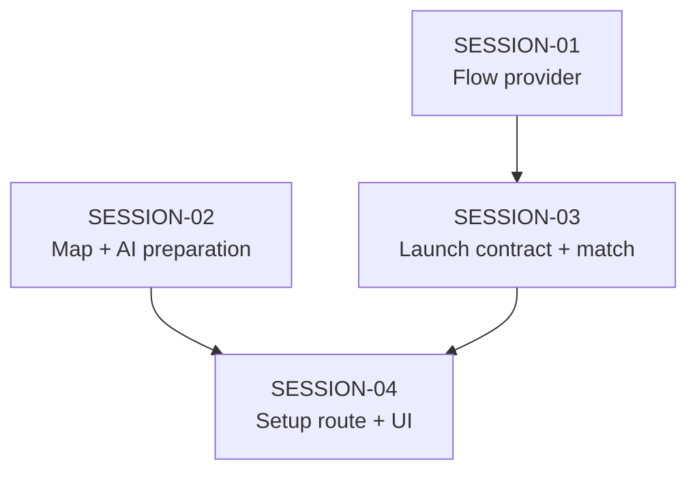

# State Tracker — SIGNAL LOSS / match-setup-route

## Program / Feature / Intent / Sessions

| Field | Value |
|---|---|
| Program | **SIGNAL LOSS** (`signal-loss`) |
| Feature | `match-setup-route` |
| Intent | Make `#/setup` resolve to a production Match Setup route that prepares a deterministic map and four AI rosters, then launches a real five-roster match. |
| Sessions | 4 total |
| Program config | `./program/signal-loss/FORGE-CONFIG.md` |
| Prompt directory | `./program/signal-loss/prompts/match-setup-route/` |

## Session Status

| # | Session | Modules | Owns | Status | Checkpoint | Completed | Notes |
|---|---|---|---|---|---|---|---|
| 01 | App-Level Flow Provider | M17, M21, M22 | `./src/app/store/core/flow-context.tsx` `./src/app/store/core/index.ts` `./src/app/main.tsx` `./tests/app/core/flow-context.test.tsx` | done | 3 | 2026-08-28 | Added app-lifetime FlowStoreProvider seam over the existing transient createFlowStore(); FlowStore shape and MatchLaunchConfig/MatchResultPayload contracts unchanged for SESSION-03 to extend atomically. |
| 02 | Deterministic Setup Preparation | M02, M12, M15, M17, M22 | `./src/app/bridge/mapgen-client.ts` `./src/app/store/build/setup-model.ts` `./src/app/store/build/index.ts` `./tests/app/setup-generation/**` | done | 3 | 2026-08-28 | Deterministic setup preparation: typed map-worker client (mapgen-client.ts), setup-domain model + cancellable createSetupGenerationService (setup-model.ts), narrow build facade re-exports. Map gen only via MapGenClient, AI rosters only via AiClient. 20 new tests. |
| 03 | Launch Contract and Match Consumption | M12, M17, M20, M22 | `./src/app/store/core/flow-store.ts` `./src/app/store/match/match-store.ts` `./src/app/store/match/types.ts` `./src/app/screens/match/MatchScreen.tsx` `./src/app/screens/match/ResultMode.tsx` `./tests/app/core/flow-store.test.ts` `./tests/app/match/match-store.test.ts` `./tests/app/match/match-launch.test.tsx` | blocked | 0 | 2026-08-28 | no handoff JSON; see `./.forge/results/SESSION-03.result.md` |
| 04 | Routed Match Setup Screen | M02, M07, M17, M19, M20, M22 | `./src/app/components/setup/**` `./src/app/screens/setup/**` `./tests/app/setup-screen/**` `./tests/e2e/setup/**` | pending | — | — | Adds the self-registering route, controls, preview/reveal, launch action, and direct-link regression coverage. |

## Wave Plan

| Wave | Sessions | Why concurrent |
|---|---|---|
| 1 | SESSION-01, SESSION-02 | Their `Owns` sets are literally disjoint: app-level flow-provider/bootstrap files versus setup worker/model files and isolated test directories. |
| 2 | SESSION-03 | Requires SESSION-01's provider artifact; it atomically changes the launch type plus every current match/result consumer, so it is intentionally one integration lease. |
| 3 | SESSION-04 | Requires SESSION-02's preparation service and SESSION-03's final launch contract/real match boot so its direct-link→deploy browser test has a valid target. |

## Dependency Graph

## Architecture Reference

- **Root cause**: `./src/app/screens/setup/route.tsx` does not exist. The eager glob in `./src/app/route-registry.tsx` therefore has no `#/setup` route, and exact resolution falls back to the first discovered route (`#/`).
- **Route repair**: SESSION-04 adds a self-registering `route` export. The registry and bootstrap stay unchanged.
- **Preparation boundary**: map generation stays behind `./src/workers/mapgen.worker.ts`; AI roster generation stays behind `./src/app/bridge/ai-client.ts` and `AI_ROSTER` protocol requests. The app does not call worker handlers or engine generators directly.
- **Launch boundary**: `MatchLaunchConfig` is transient state in the app-level `FlowStore`. It carries the selected human roster, four generated AI rosters, generated map, exact settings, and share strings; it is never persisted.
- **Match invariant**: `MatchStore.boot` receives the prepared payload and creates `[human, ai1, ai2, ai3, ai4]`, eliminating the current temporary duplicate-human fallback.
- **Information/determinism**: the seed is concrete and visible before generation; every map/AI request uses it; no hidden retry, random fallback, or network call is allowed.

## Scope Summary

| Module | Change |
|---|---|
| M17 — App state and bridge | Add a flow-provider seam, map-worker client, setup preparation service, and complete transient launch payload. |
| M20 — Screens | Make `#/match` consume a payload and add self-discoverable `#/setup`. |
| M19 — UI components | Add only setup-specific controls, roster picker, map preview, and AI reveal components. |
| M12 / M15 — Engine/workers | Read-only consumers of existing facade/protocol; no engine or worker-entry modifications. |
| M22 — Tests | Add separate provider, setup-generation, setup-screen, match-launch, and setup e2e coverage. |

## Design Decisions

| Choice | Rationale |
|---|---|
| Route module rather than registry edit | `./src/app/route-registry.tsx` is intentionally self-discovering; adding `./src/app/screens/setup/route.tsx` fixes the missing exact path without destabilizing all routes. |
| Full setup rather than a placeholder | FR-8 through FR-12 and the approved mock require configuration, legal roster choice, deterministic generation, and pre-deployment AI reveal. A landing page that cannot launch would preserve the defect in another form. |
| New `FlowStoreProvider` | The existing vanilla flow store has no app-lifetime React owner; a provider gives setup and match the same transient instance across a hash change. |
| Atomic launch-contract consumer update | Required fields cannot be introduced in a standalone type-only session because `MatchStore`, `ResultMode`, and tests would stop compiling. SESSION-03 owns all those consumers. |
| Map and AI preparation service | Keeps worker transport, cancellation, stream labels, and errors outside React; screen code only renders state and dispatches a prepared payload. |
| Prebuilts as launchable sources | The documented first-match flow begins with a prebuilt and must work with an empty local collection; a prebuilt must not be forged into a persisted roster. |
| No standalone result/composer work | Those unfinished routes are unrelated write sets. SESSION-03 only prevents result-payload type corruption while preserving its current screen scope. |

## Handoff Notes

### SESSION-01 — done

- **Notes:** Added app-lifetime FlowStoreProvider seam over the existing transient createFlowStore(); FlowStore shape and MatchLaunchConfig/MatchResultPayload contracts unchanged for SESSION-03 to extend atomically.
- **Delivered:** FlowStoreProvider + useFlowStore/useFlowStoreApi hooks, exported via the core facade and mounted below ErrorBoundary inside StrictMode; 5 SSR provider tests.
- **Verification:** npx vitest run flow-context+flow-store -> 8 pass; npm run typecheck, lint, build all pass; route-registry.tsx unchanged; owned code storage-free.
- **Surprises:** Rewrote one docstring token in flow-context.tsx from `localStorage` to `browser storage` so the CP3 no-storage source-inspection test does not false-positive on its own comment. StrictMode's double render does not leak a second store — the lazy useRef guard retains exactly one.
- **Follow-up:** SESSION-03 must preserve the existing FlowStore API exactly (pendingLaunch/lastResult/requestedEntity + setPendingLaunch/setLastResult/requestEntity/clear); it owns the backward-incompatible MatchLaunchConfig launch-field extension plus every consumer so each commit keeps typechecking. Callers import the provider through ./src/app/store/core/index.ts, never the context path directly.
- **Files touched:** `./src/app/store/core/flow-context.tsx`, `./src/app/store/core/index.ts`, `./src/app/main.tsx`, `./tests/app/core/flow-context.test.tsx`

### SESSION-02 — done

- **Notes:** Deterministic setup preparation: typed map-worker client (mapgen-client.ts), setup-domain model + cancellable createSetupGenerationService (setup-model.ts), narrow build facade re-exports. Map gen only via MapGenClient, AI rosters only via AiClient. 20 new tests.
- **Delivered:** createMapGenClient/browserMapGenWorker (request-id-multiplexed, cancellable, typed MAP_MAX_REGEN/WORKER_DOWN/MESSAGE_MALFORMED surface, dispose drains without throwing); makeSetupDraft/selectorForArchetype/validateSetupDraft; createUserSeed (Crypto-shaped source, typed ENTROPY_UNAVAILABLE, never Math.random/clock); prepareSetup + createSetupGenerationService (one MAP_GEN + four AI_ROSTER, fixed squad-order failure branch, monotonic generationId, dispose releases both clients); additive facade exports from ./src/app/store/build/index.ts.
- **Verification:** npx vitest run ./tests/app/setup-generation → 20 pass (7 mapgen-client + 13 setup-model); tests/app/build+core consumers → 122 pass; npm run typecheck, lint, build all pass (Vite emits mapgen.worker-*.js from the browser factory); boundary grep confirms no generateMap/generateAiRoster/worker-handler/localStorage/fetch/Math.random/clock in setup code.
- **Surprises:** CP1's first commit (00eafae) swept in a pre-staged foreign change to program/signal-loss/arch/M17-app-state-bridge.md — a concurrent SESSION-01 arch fragment already staged in the shared index (startup tree was clean). Detected in git status; remedied with `git restore --source=HEAD~1 --staged` + `git commit --amend` (CP1 is now 767575a), removing it from my commit while preserving SESSION-01's change as an unstaged worktree modification (never git-reset). Thereafter I scrubbed the shared index against my lease before every commit; CP2/CP3 are clean. That arch md change is still unstaged in the worktree — it is Jikijitsu/SESSION-01's, left untouched. A concurrent `match-setup-route SESSION-01: record completion` commit (d10c4b0) also interleaved onto main between my CP1 and CP2 — expected under one-branch orchestration; my history stayed lease-only.
- **Follow-up:** Exact AI stream labels are ai.squad1.roster, ai.squad2.roster, ai.squad3.roster, ai.squad4.roster (AI_ROSTER_STREAM_LABELS const). Worker-protocol limitation for SESSION-04: the AI_ROSTER request carries no tier field — roster generation is tier-independent — so SetupDraft.aiTier is preserved into PreparedSetup for match-config use, NOT threaded into roster generation. MapGenRequest needs archetypes + tunables; the client forwards catalog.mapArchetypes/catalog.tunables. Deterministic fixture hash for one prepared result (fake transport: seed=deadbeefcafef00d, budget=100, aiTier=2, selector any, rosters of length 1/2/3/4): sha256 fa7a822dd1f352a0aa595470d484f291163de1c7395210448683d942d66582c3 over 793 bytes of JSON.stringify(SetupPreparationResult). SESSION-04 should share the AI worker factory with the match store (one pool) and pass browserMapGenWorker as the map factory. Arch delta written to .forge/signal/SESSION-02.arch.md (uncommitted, for Jikijitsu).
- **Files touched:** `./src/app/bridge/mapgen-client.ts`, `./src/app/store/build/setup-model.ts`, `./src/app/store/build/index.ts`, `./tests/app/setup-generation/mapgen-client.test.ts`, `./tests/app/setup-generation/setup-model.test.ts`

### SESSION-03 — blocked

- **Reason:** no handoff JSON; see `./.forge/results/SESSION-03.result.md`
- **Last checkpoint:** 0 — no `match-setup-route SESSION-03` checkpoint commit exists under the lease; the listed lease history belongs to the prior `full-v1` feature.
- **Runtime reply:** API Error: Server error mid-response. The response above may be incomplete.
