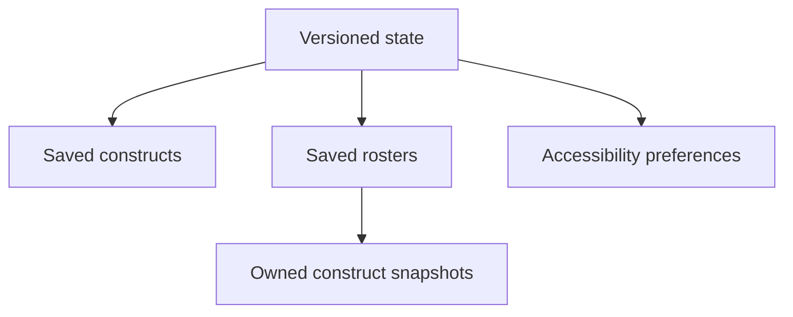

# Data Persistence Design — SIGNAL LOSS

**Status:** draft 1 · awaiting builder approval · phase `database`

**Derived from:** `./specs/requirements.md`, `./specs/architecture.md`

**Owns permanently:** `./src/migrations/001_initial.ts` and every future file under
`./src/migrations/`

---

## 1. Engine

SIGNAL LOSS has **no server database**. The approved architecture selects browser
`localStorage`, accessed through a `CollectionRepository` port, because v1 is a static,
offline, single-user product and the expected collection is far below browser quota.

| Property | Decision |
|---|---|
| Storage engine | Browser `localStorage` |
| Primary key | `signal-loss:state` |
| Serialization | Strict JSON; one versioned root document |
| Current schema version | `1` |
| Transaction boundary | One atomic `localStorage.setItem` replacing the root document |
| Encryption | None; records contain roster data and preferences, not secrets or PII |
| Network replication | None; prohibited by NFR-8 and the approved CSP |
| Multi-user semantics | None |
| Multi-tab semantics | One active writer is assumed; revision checks detect stale tabs when observable |

The persistence schema version, share-string format version, catalog hash, tunables hash,
and match-log format version are **independent version domains**. Advancing one never
implicitly advances another.

---

## 2. Scope

### Persisted

- User-saved constructs and their local names (FR-6).
- User-saved rosters, their local names, budgets, and owned construct snapshots (FR-6).
- Reduced-motion and high-contrast-squad preferences required by the approved design and
  NFR-5.
- Schema metadata needed for safe migration and stale-write detection.

### Not persisted

- Authored catalog entries, tunables, map archetypes, and prebuilts. Those remain build
  artifacts under `./data/`; prebuilts are read-only content, not collection records.
- The current match, AI state, maps, deployments, or plots. Closing the tab ends an
  in-progress match in v1.
- `MatchLog` or `Event[]` after leaving the result flow. The approved architecture retains
  the complete event log **for the lifetime of the match**, but no requirement asks for a
  replay library across browser sessions.
- Imported share strings before the player explicitly chooses **ADD TO COLLECTION**.
- Share-string text itself. The persisted model stores the decoded composition; the codec
  remains an independent interchange format.
- Accounts, telemetry, analytics, cloud copies, or user-identifying data.

---

## 3. Schema Overview

One root document makes a logical save atomic: constructs, rosters, preferences, the id
counter, and the revision cannot land at different versions.



**A saved roster owns its construct snapshots.** It never stores foreign keys to saved
construct records. Consequently:

- deleting or renaming a saved construct cannot corrupt or mutate a roster;
- editing a saved construct does not silently rewrite rosters that used it;
- a roster remains self-contained for FR-7 export;
- duplicating a prebuilt or imported roster creates one independent record.

This deliberate denormalization matches the domain: saved constructs are reusable
templates, while constructs inside a roster are composition snapshots.

---

## 4. Root Document: `PersistedStateV1`

| Field | Type | Constraints | Purpose |
|---|---|---|---|
| `schemaVersion` | integer | Required; exactly `1` | Chooses the forward migration chain |
| `revision` | integer | Required; safe integer ≥ 0 | Increments once per successful logical write |
| `nextEntityId` | integer | Required; safe integer ≥ 1 and greater than every allocated suffix | Collision-free local id allocation |
| `constructs` | `SavedConstructV1[]` | Required; no product-imposed collection-count cap | User construct collection |
| `rosters` | `SavedRosterV1[]` | Required; no product-imposed collection-count cap | User roster collection |
| `preferences` | `PreferencesV1` | Required | Accessibility presentation settings |

### Canonical empty state

```json
{
  "schemaVersion": 1,
  "revision": 0,
  "nextEntityId": 1,
  "constructs": [],
  "rosters": [],
  "preferences": {
    "reducedMotion": "system",
    "highContrastSquads": false
  }
}
```

The root object and every nested record use an **exact-field schema**. Missing and unknown
fields are structural errors; migrations must explicitly account for schema changes rather
than allowing accidental data to become a de facto API.

---

## 5. Collections

### 5.1 `SavedConstructV1`

| Field | Type | Constraints | Notes |
|---|---|---|---|
| `id` | string | Required; `construct:<positive-safe-integer>`; globally unique | Local identity only; never enters a share string or match rules |
| `name` | string | Required; at least one non-whitespace character | Duplicate names are allowed; storage quota is the only length/capacity ceiling |
| `construct` | `ConstructSnapshotV1` | Required; structurally valid | Composition data |

There is no timestamp. Requirements do not display or query one, and storing unnecessary
behavioral metadata would not improve the product. Array position is the collection's
stable presentation order; rename does not reorder, duplicate appends, and delete preserves
the relative order of remaining records.

### 5.2 `SavedRosterV1`

| Field | Type | Constraints | Notes |
|---|---|---|---|
| `id` | string | Required; `roster:<positive-safe-integer>`; globally unique | Local identity only |
| `name` | string | Required; at least one non-whitespace character | Duplicate names are allowed |
| `budget` | integer | Required; one of `25, 50, 75, 100, 125, 150, 175, 200` | Budget carried by FR-7 and validated by FR-4 |
| `constructs` | `ConstructSnapshotV1[]` | Required | Embedded owned snapshots; not foreign keys |

The persistence layer permits a structurally readable roster that is currently illegal
(for example, zero commanders or a roster invalidated by a later balance update). The
engine's `validateRoster` remains the sole source of game legality. This supports the
collection screen's legality state and prevents persistence from silently deleting a
player's work.

### 5.3 `ConstructSnapshotV1`

| Field | Type | Constraints | Notes |
|---|---|---|---|
| `chassisCode` | integer | Required; `1..4095` | Stable catalog wire code; never reused or renumbered |
| `commanderCode` | integer or `null` | Required; `null` or `1..15` | `null` means untagged |
| `mounts` | `MountAssignmentV1[]` | Required; hardpoint indices unique and ascending | Empty hardpoints are represented by absent assignments |

Snapshots use stable numeric catalog codes rather than authored string ids. The codes are
already the architecture's persistent wire identity. A structurally valid code that does
not exist in the **current** catalog is preserved and reported as an unknown catalog
reference; it is never remapped or dropped.

### 5.4 `MountAssignmentV1`

| Field | Type | Constraints | Notes |
|---|---|---|---|
| `hardpointIndex` | integer | Required; `0..15`; unique per snapshot | Zero-based chassis port position |
| `mountCode` | integer | Required; `1..4095` | Stable catalog wire code |

Assignments are sorted by ascending `hardpointIndex`. This yields one canonical JSON shape
for a composition and prevents object-property enumeration order from becoming meaningful.
Port existence, port-type compatibility, current costs, and roster legality are catalog /
engine validations rather than persistence constraints.

### 5.5 `PreferencesV1`

| Field | Type | Constraints | Default | Notes |
|---|---|---|---|---|
| `reducedMotion` | enum | `system`, `reduced`, or `full` | `system` | Follow OS, force reduced playback, or force full playback |
| `highContrastSquads` | boolean | Required | `false` | Enables the hue-independent squad treatment |

Preferences affect presentation only. They never enter `MatchState`, the canonical state
hash, AI decisions, resolution, or replay identity.

---

## 6. Identity and Relationships

`nextEntityId` is a global monotonic counter shared by both record collections:

1. A construct allocation produces `construct:<nextEntityId>`.
2. A roster allocation produces `roster:<nextEntityId>`.
3. The counter increments in the same root-document write that adds the record.

IDs are not random, contain no personal data, and never cross the platform/engine boundary
as rules input. Deleted ids are never reused. A migration may leave gaps but must preserve
all existing ids and set `nextEntityId` above the largest suffix.

There are intentionally **no foreign keys**:

- roster → construct is ownership-by-value;
- saved construct → catalog and snapshot → catalog are validated code references to
  immutable authored build data, not local database relationships;
- prebuilts never become writable records until explicitly duplicated.

---

## 7. Validation Boundaries

Loading follows three independent validation layers:

| Layer | Owner | Checks | Failure behavior |
|---|---|---|---|
| JSON | `CollectionRepository` | Parseable JSON root | Return `MALFORMED_JSON`; preserve raw value; do not overwrite |
| Persistence schema | `./src/migrations/001_initial.ts` | Exact fields, primitive types, ranges, ids, uniqueness, canonical mount order | Return path-specific `SchemaIssue[]`; do not repair |
| Catalog and rules | Engine catalog/build modules | Known codes, port compatibility, exactly one commander, cost, squad size, current tunables | Keep record visible and mark it invalid with engine `Violation[]` |

**Structural corruption** prevents normal mutation because rewriting a partially understood
document risks data loss. **Domain illegality does not.** Players may rename, duplicate,
delete, or repair a structurally valid but currently illegal record.

No loader may silently:

- replace a malformed root with the empty state;
- delete a bad record from an otherwise readable document;
- substitute an unknown catalog code;
- clamp a budget or hardpoint index;
- add/remove commanders or mounts to make a roster legal;
- accept a future schema version by guessing.

---

## 8. Data Access Contract

Coder implements the `CollectionRepository` under the architecture's platform/storage
module. The repository exposes behaviors equivalent to the following; this is a contract,
not application implementation:

| Operation | Input | Result / invariant |
|---|---|---|
| Load | None | Current `PersistedStateV1`, migrated before exposure |
| Save construct | Expected revision, name, snapshot | Allocates id for create or replaces matching id; one revision increment |
| Save roster | Expected revision, name, budget, snapshots | Allocates id for create or replaces matching id; one revision increment |
| Rename | Expected revision, entity id, nonblank name | Changes name only; composition and order remain unchanged |
| Duplicate | Expected revision, entity id | Deep-copies value, allocates a new id, appends record; caller supplies/confirms copied name |
| Delete | Expected revision, entity id, confirmed intent | Removes exactly one record; never cascades |
| Save preferences | Expected revision, complete `PreferencesV1` | Presentation-only update; one revision increment |
| Reset corrupt store | Explicit destructive recovery intent | Replaces raw data with canonical empty v1; never automatic |

All writes follow one sequence:

1. Read and validate the current root.
2. Reject if its `revision` differs from the caller's expected revision.
3. Apply the mutation to a fresh value.
4. Canonicalize mount assignments and increment `revision` exactly once.
5. Run persistence validation; run engine validation to classify current legality without
   mutating or silently repairing the stored composition.
6. `JSON.stringify` the entire candidate before touching storage.
7. Replace `signal-loss:state` with one synchronous `setItem` call.
8. Publish the new state to the UI only after `setItem` succeeds.

`localStorage.setItem` replaces a single key atomically. If serialization or the write
throws, the previously stored string remains the committed state. The UI must not claim
success from an in-memory mutation that was not committed.

The architecture defines one browser tab at runtime. The revision is therefore an
optimistic stale-tab guard, not a claim that `localStorage` provides compare-and-swap. The
repository listens for the browser `storage` event, invalidates stale in-memory state, and
requires reload/retry before another mutation. Truly simultaneous multi-tab writes are
outside v1's supported operating model.

---

## 9. Error Contract

Repository failures are a discriminated result, not `null`, an empty collection, or an
unhandled exception.

| Error | Trigger | Required handling |
|---|---|---|
| `STORAGE_UNAVAILABLE` | Access throws `SecurityError`, storage disabled, or capability probe fails | Product remains usable without persistence; clearly report saves unavailable |
| `MALFORMED_JSON` | Stored string cannot be parsed | Preserve raw string; block normal writes; require explicit recovery |
| `UNSUPPORTED_VERSION` | Stored `schemaVersion` is newer or has no forward path | Do not downgrade or overwrite; report installed app cannot read it |
| `INVALID_SCHEMA` | Persistence validator returns issues | Preserve raw string and path-specific issues; no silent repair |
| `MIGRATION_FAILED` | A forward migration rejects or throws | Keep the old string untouched; report source and target versions |
| `STALE_REVISION` | Expected revision differs from current persisted revision | Reload current state and make the user retry the action |
| `QUOTA_EXCEEDED` | `setItem` throws `QuotaExceededError` | Keep prior state; surface the persistent storage banner required by FR-6 |
| `WRITE_FAILED` | Any other serialization or storage exception | Keep prior state and report save failure |
| `ENTITY_NOT_FOUND` | Update/delete targets no existing id | Do not create or delete anything else |

The recovery surface may expose the original raw JSON for clipboard copying, but v1 does
not promise file export or automatic salvage (A-1). Reset requires the same explicit,
destructive confirmation standard as deletion.

---

## 10. Query Patterns

The complete root is read once at boot and held in the application store. Normal UI reads
do **not** repeatedly call `localStorage`.

| Pattern | Query shape | Index |
|---|---|---|
| Load collection and preferences | `getItem("signal-loss:state")` → parse → migrate → validate | Primary key lookup supplied by `localStorage` |
| List constructs | Iterate `state.constructs` in stored order | None; in-memory array scan |
| List rosters | Iterate `state.rosters` in stored order | None; in-memory array scan |
| Find entity by id | Linear scan of the appropriate in-memory array | None; expected data is constrained by browser quota, not server scale |
| Filter rosters by budget | In-memory predicate on `budget` | None |
| Render legality state | Engine validation over each decoded snapshot | None; current catalog/tunables are required |
| Save any mutation | Replace the single root JSON document | One-key atomic write |

There are no secondary indexes because `localStorage` has no index facility and maintaining
manual index copies would create additional consistency surfaces without a demonstrated
query need. If collection size ever makes array scans measurable, Architect must revisit
the engine choice; DB must not smuggle an IndexedDB migration into Forge work.

---

## 11. Migration Protocol

Migrations are **pure, synchronous, deterministic, forward-only functions over parsed
JSON**. They perform no browser I/O, catalog lookup, wall-clock read, random id generation,
or network call.

At startup:

1. Read the raw primary value without modifying it.
2. If absent, apply migration `001` to `null` and obtain the canonical empty v1 state.
3. If present, parse JSON and inspect `schemaVersion`.
4. Reject an unversioned non-null object or a future version rather than guessing.
5. Apply each required migration in numeric order, entirely in memory.
6. Validate the final document with the target version's structural validator.
7. Serialize the final document completely.
8. Commit it with one `setItem` only if migration changed the document.

If any step fails, the original primary string remains untouched. A future change adds a
new numbered file such as `./src/migrations/002_<description>.ts`; it never edits
`./src/migrations/001_initial.ts`. Every migration must also accept already-migrated target
data and return it unchanged, making application safe after interrupted startup or repeated
execution.

### Migration history and permanent ownership

| # | From → To | Description | Owned file |
|---|---|---|---|
| 001 | absent (`0`) → `1` | Canonical root, saved constructs, owned roster snapshots, accessibility preferences, strict v1 validator | `./src/migrations/001_initial.ts` |

Forge and all later implementation sessions must treat every path in this table as
**already owned by DB**. No session may include it in `Owns`. Schema changes return to DB
and land as new forward migrations.

---

## 12. Seed Data

The local store seeds only the canonical empty state and preference defaults shown in §4.

Prebuilt rosters are **not** inserted into writable persistence. They remain validated,
read-only content from `./data/catalog.prebuilts.json`. **DUPLICATE TO EDIT** creates a new
user roster with a new local id; the source prebuilt remains unchanged.

---

## 13. Requirements Coverage

| Requirement | Persistence decision |
|---|---|
| FR-5 Prebuilts | Read-only authored data; duplication creates an independent saved roster |
| FR-6 Local collection | Constructs and rosters support save, rename, duplicate, and confirmed delete; one root survives sessions; quota failure is explicit |
| FR-7 Sharing | Persist decoded composition; local ids and names never enter share strings; imported data is saved only after explicit confirmation |
| FR-24 Information contract | Persistence contains no private committed intent or hidden AI information |
| FR-29 Determinism | Preferences and local ids never enter rule state; migrations are deterministic |
| FR-30 Data-driven tuning | Catalog stays authored under `./data/`; persistence stores stable references and revalidates against current content |
| NFR-5 Accessibility | Reduced-motion and high-contrast settings survive sessions |
| NFR-7 Offline | Storage requires no runtime service or request |
| NFR-8 Privacy | Plain local roster data only; no accounts, telemetry, network copy, or PII |
| A-1 Browser-session persistence | Closing/reopening retains the root; clearing site data is accepted data loss |

---

## 14. Database-Phase Decisions for Approval

- **One atomic versioned root** at `signal-loss:state`, rather than one key per entity.
- **Roster composition is embedded by value**, so construct edits/deletes never cascade.
- **Monotonic local ids**, not random identifiers or timestamps.
- **Structurally valid but game-illegal records are preserved** for repair; only the
  engine decides legality.
- **Accessibility preferences persist; active matches and match logs do not.**
- **No secondary indexes and no server/IndexedDB layer** in v1.
- **Migration 001 is idempotent and rejects guessing or silent reset.**

These decisions satisfy the approved architecture without introducing a new database
engine or backend.
